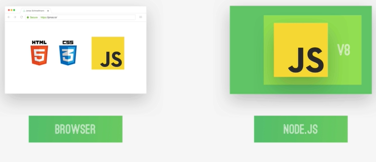

# Introduction to Node.js

#### 1. What is Node.js?

- Node.js is a javascript runtime built on Google's open source V8 javascript engine.

#### 2. Node.js : JavaScript outside of the Browser.



#### 3. JavaScript on the Server!

- Perfect conditions for using Node.js as a Web Server
- We can use JavaScript on the server side of web development
- Build fast, Highly scalable network applications(backend)

#### 4. Why And When to Use Node.js?

##### Node.js Pros

- Single-threaded, based on even driven, non-blocking I/O models
- Perfect for building fast and scalable data-intensive apps.
- Companies like NETFLIX, PAYPAL, UBER, ebay have started using node in production.
- JavaScript across the entire stack: faster and more
  efficient development.
- NPM: huge library of open-source packages available
  for everyone for free.

##### Use Node.js

- Api with database behind it (preferably NoSql).
- Data streaming (think youtube)
- Real-time chat application
- Server-side web Application

##### Don't Use

- Applications with heavy server-side processing (CPU-intensive).

#### 5. Fs

```js
import fs from 'fs';

//utf-8 -> Unicode Transformation Format 8
const textIn = fs.readFileSync('./txt/input.txt', 'utf-8');
console.log(textIn);

const textOut = `This is what we know about the avocado: ${textIn}. \n Created on ${Date.now()}`;
fs.writeFileSync('./txt/output.txt', textOut);
```

#### 6. BLOCKING AND NON-BLOCKING: ASYNCHRONOUS NATURE OF NODEJS


- Non-blocking 1/0 model
- This is why we use so many callback functions in Node.js
- Callbacks !== Asynchronous

#### 7. READING AND WRITING FILES ASYNCHRONOUSLY

```js
// NON-BLOCKING, Asynchronous way

// 1.
fs.readFile('./txt/start.txt', 'utf-8', (err, data) => {
  console.log(data);
  ('');
});
// 2.
fs.readFile('./txt/start.txt', 'utf-8', (err, data1) => {
  fs.readFile(`./txt/${data1}.txt`, 'utf-8', (err, data2) => {
    console.log(data2);
  });
});
// 3.
fs.readFile('./txt/start.txt', 'utf-8', (err, data1) => {
  fs.readFile(`./txt/${data1}.txt`, 'utf-8', (err, data2) => {
    console.log(data2);
    fs.readFile(`./txt/append.txt`, 'utf-8', (err, data3) => {
      console.log(data3);
    });
  });
});
// 4.
fs.readFile('./txt/start.txt', 'utf-8', (err, data1) => {
  fs.readFile(`./txt/${data1}.txt`, 'utf-8', (err, data2) => {
    console.log(data2);

    fs.readFile(`./txt/append.txt`, 'utf-8', (err, data3) => {
      console.log(data3);

      fs.writeFile(
        `./txt/final.txt`,
        `${data2}\n\n${data3}`,
        'utf-8',
        (err) => {
          console.log('Your File has been written');
        }
      );
    });
  });
});

// 5.
fs.readFile('./txt/startt.txt', 'utf-8', (err, data1) => {
  fs.readFile(`./txt/${data1}.txt`, 'utf-8', (err, data2) => {
    if (err) return console.log('Error!');

    fs.readFile(`./txt/append.txt`, 'utf-8', (err, data3) => {
      console.log(data3);

      fs.writeFile(
        `./txt/final.txt`,
        `${data2}\n\n${data3}`,
        'utf-8',
        (err) => {
          console.log('Your File has been written');
        }
      );
    });
  });
});

console.log('Will read file');
```

#### 8. A SIMPLE WEB SERVER

```js
//! A SIMPLE WEB SERVER

const PORT = 8000;
const server = http.createServer((req, res) => {
  console.log(req);
  res.end('Hello from the server!');
});

server.listen(PORT, '127.0.0.1', () => {
  console.log(`Listening to requests on port http://127.0.0.1:8000/`);
});
```

#### 9. ROUTES

```js
import http from 'http';
import url from 'url';

//! Routes
const PORT = 8000;
const server = http.createServer((req, res) => {
  const pathName = req.url;

  if (pathName === '/' || pathName === '/overview') {
    res.end('this is the overview');
  } else if (pathName === '/product') {
    res.end('this is the product');
  } else {
    res.writeHead(404, {
      'Content-type': 'text/html',
      'my-own-header': 'Hello, world',
    });
    res.end('Hello From the Server');
  }
});

server.listen(PORT, '127.0.0.1', () => {
  console.log(`Listening to requests on port http://127.0.0.1:${PORT}/`);
});
```

#### 10. BUILDING A (VERY) SIMPLE API

```js
import http from 'http';
import url from 'url';
import fs from 'fs';
import path from 'path';

//! BUILDING A (VERY) SIMPLE API
const PORT = 8000;

const data = fs.readFileSync(`./dev-data/data.json`, 'utf-8');
const dataObj = JSON.parse(data);

const server = http.createServer((req, res) => {
  const pathName = req.url;

  if (pathName === '/' || pathName === '/overview') {
    res.end('this is the overview');
  } else if (pathName === '/product') {
    res.end('this is the product');
  } else if (pathName === '/api') {
    res.writeHead(200, { 'Content-type': 'application/json' });
    res.end(data);
  } else {
    res.writeHead(404, {
      'Content-type': 'text/html',
      'my-own-header': 'Hello, world',
    });
    res.end('<h1>Page Not Found</h1>');
  }
});

server.listen(PORT, '127.0.0.1', () => {
  console.log(`Listening to requests on port http://127.0.0.1:${PORT}/api`);
});
```

##### HTML Templating Building the Templates

```html
<!DOCTYPE html>
<html lang="en">
  <head>
    <meta charset="UTF-8" />
    <meta name="viewport" content="width=device-width, initial-scale=1.0" />
    <meta http-equiv="X-UA-Compatible" content="ie=edge" />
    <link
      href="https://fonts.googleapis.com/css?family=Megrim|Nunito+Sans:400,900"
      rel="stylesheet"
    />
    <link
      rel="icon"
      href="https://emojipedia-us.s3.dualstack.us-west-1.amazonaws.com/thumbs/240/apple/155/ear-of-maize_1f33d.png"
    />

    <title>NODE FARM</title>

    <style>
      *,
      *::before,
      *::after {
        margin: 0;
        padding: 0;
        box-sizing: inherit;
      }

      html {
        font-size: 62.5%;
        box-sizing: border-box;
      }

      body {
        padding: 5rem 5rem 10rem;
        line-height: 1.7;
        font-family: 'Nunito Sans', sans-serif;
        color: #555;
        min-height: 100vh;
        background: linear-gradient(to bottom right, #9be15d, #00e3ae);
      }

      h1 {
        font-family: 'Megrim', sans-serif;
        font-size: 6rem;
        color: white;
        transform: skewY(-5deg);
        text-align: center;
        position: relative;
        word-spacing: 3px;
      }

      h1::before {
        content: '';
        display: block;
        height: 65%;
        width: 49%;
        position: absolute;
        top: 105%;
        left: 50%;
        background: linear-gradient(to bottom, #9be15d, #00e3ae);
        opacity: 0.8;
        z-index: -1;
        transform: skewY(370deg) translate(-50%, -50%);
      }

      .container {
        width: 95rem;
        margin: 0 auto;
      }

      .cards-container {
        margin-top: 8rem;
      }

      .card {
        background: white;
        box-shadow: 0 2rem 6rem 1rem rgba(0, 0, 0, 0.15);
        margin-bottom: 5rem;
        transform: skewX(-20deg);
        display: flex;
        transition: all 0.5s;
      }

      .card__emoji {
        font-size: 5.5rem;
        line-height: 1.2;
        padding: 1.5rem 6rem 0.5rem 1.5rem;
        letter-spacing: -4rem;
        transform: skewX(20deg);
      }

      .card__title-box {
        background: linear-gradient(to bottom, #9be15d, #00e3ae);
        margin-right: auto;
        display: flex;
        align-items: center;
        padding: 0 3rem;
      }

      .card__title {
        font-family: 'Megrim', sans-serif;
        color: white;
        font-size: 3.25rem;
        transform: skewX(20deg);
      }

      .card__details {
        display: flex;
      }

      .card__detail-box {
        align-self: stretch;
        border-right: 1px solid #ddd;
        display: flex;
        align-items: center;
      }

      .card__detail-box:last-child {
        border: none;
      }

      .card__detail {
        font-weight: 400;
        font-size: 1.8rem;
        transform: skewX(20deg);
        padding: 1.75rem;
      }

      .card__detail--organic {
        font-weight: 900;
        text-transform: uppercase;
        font-size: 1.9rem;
        background-image: linear-gradient(to right, #9be15d, #00e3ae);
        -webkit-background-clip: text;
        background-clip: text;
        color: transparent;
      }

      .card__detail--price {
        font-weight: 900;
        font-size: 1.9rem;
      }

      .card__link:link,
      .card__link:visited {
        flex: 0 0 auto;
        background-color: #79e17b;
        color: white;
        font-size: 1.6rem;
        font-weight: 900;
        text-transform: uppercase;
        text-decoration: none;
        padding: 2.5rem;
        text-align: center;
        display: flex;
        align-items: center;
        justify-content: center;
        transition: all 0.3s;
      }

      .card__link:hover,
      .card__link:active {
        background-color: #9be15d;
      }

      .card__link span {
        transform: skewX(20deg);
      }

      .card:hover {
        transform: skewX(-20deg) scale(1.08);
        box-shadow: 0 3rem 8rem 2rem rgba(0, 0, 0, 0.15);
      }

      .emoji-left {
        font-size: 2rem;
        margin-right: 1rem;
      }

      .emoji-right {
        font-size: 2rem;
        margin-left: 1rem;
      }

      .not-organic {
        display: none;
      }
    </style>
  </head>

  <body>
    <div class="container">
      <h1>🌽 Node Farm 🥦</h1>

      <div class="cards-container"></div>
    </div>
  </body>
</html>
```

```html
<!DOCTYPE html>
<html lang="en">
  <head>
    <meta charset="UTF-8" />
    <meta name="viewport" content="width=device-width, initial-scale=1.0" />
    <meta http-equiv="X-UA-Compatible" content="ie=edge" />
    <link
      href="https://fonts.googleapis.com/css?family=Megrim|Nunito+Sans:400,900"
      rel="stylesheet"
    />
    <link
      rel="icon"
      href="https://emojipedia-us.s3.dualstack.us-west-1.amazonaws.com/thumbs/240/apple/155/ear-of-maize_1f33d.png"
    />

    <title>  /// NODE FARM</title>

    <style>
      *,
      *::before,
      *::after {
        margin: 0;
        padding: 0;
        box-sizing: inherit;
      }

      html {
        font-size: 62.5%;
        box-sizing: border-box;
      }

      body {
        padding: 5rem 5rem 10rem;
        line-height: 1.7;
        font-family: 'Nunito Sans', sans-serif;
        color: #555;
        min-height: 100vh;
        background: linear-gradient(to bottom right, #9be15d, #00e3ae);
      }

      h1 {
        font-family: 'Megrim', sans-serif;
        font-size: 6rem;
        color: white;
        transform: skewY(-5deg);
        text-align: center;
        position: relative;
        word-spacing: 3px;
      }

      h1::before {
        content: '';
        display: block;
        height: 65%;
        width: 49%;
        position: absolute;
        top: 105%;
        left: 50%;
        background: linear-gradient(to bottom, #9be15d, #00e3ae);
        opacity: 0.8;
        z-index: -1;
        transform: skewY(370deg) translate(-50%, -50%);
      }

      .container {
        width: 95rem;
        margin: 0 auto;
      }

      .product {
        width: 60rem;
        margin: 0 auto;
        margin-top: 9rem;
        background: white;
        box-shadow: 0 3rem 6rem 1rem rgba(0, 0, 0, 0.2);
        position: relative;
      }

      .product__hero {
        position: relative;
        height: 22rem;
        overflow: hidden;
      }

      .product__hero::before {
        content: '';
        display: block;
        height: 100%;
        width: 100%;
        position: absolute;
        top: 0;
        left: 0;
        background-image: linear-gradient(to left bottom, #9be15d, #00e3ae);
        opacity: 0.5;
        z-index: 100;
      }

      .product__emoji {
        font-size: 15rem;
        position: absolute;
      }

      .product__emoji--1 {
        top: -4rem;
        left: -2rem;
        z-index: 10;
      }

      .product__emoji--2 {
        top: -6rem;
        left: 9rem;
      }

      .product__emoji--3 {
        top: -4rem;
        right: 15rem;
      }

      .product__emoji--4 {
        top: -5rem;
        right: 2rem;
        z-index: 10;
      }

      .product__emoji--5 {
        bottom: -9rem;
        left: 18rem;
      }

      .product__emoji--6 {
        bottom: -8rem;
        left: 5rem;
      }

      .product__emoji--7 {
        bottom: -12rem;
        right: 14rem;
      }

      .product__emoji--8 {
        bottom: -8rem;
        right: -2rem;
      }

      .product__emoji--9 {
        top: -7rem;
        left: 19rem;
      }

      .product__organic {
        position: absolute;
        top: -4rem;
        right: -4rem;
        z-index: 1000;
        height: 11rem;
        width: 11rem;
        background-image: linear-gradient(to bottom, #9be15d, #00e3ae);
        border-radius: 50%;
        transform: rotate(15deg);
        box-shadow: 0 2rem 4rem rgba(0, 0, 0, 0.4);
        display: flex;
        align-items: center;
        justify-content: center;
      }

      .product__organic h5 {
        font-weight: 900;
        text-transform: uppercase;
        font-size: 1.8rem;
        color: white;
      }

      .product__back:link,
      .product__back:visited {
        position: absolute;
        top: 2rem;
        left: 2rem;
        font-size: 1.5rem;
        font-weight: 700;
        text-transform: uppercase;
        text-decoration: none;
        z-index: 1000;
        color: #555;
        background-color: white;
        box-shadow: 0 1rem 3rem rgba(0, 0, 0, 0.3);
        border-radius: 100rem;
        padding: 0 2rem;
        transition: all 0.3s;
        display: flex;
        align-items: center;
      }

      .product__back:hover,
      .product__back:active {
        background-color: #79e17b;
      }

      .product__name {
        background: linear-gradient(to bottom, #9be15d, #00e3ae);
        padding: 1rem;
        font-family: 'Megrim', sans-serif;
        font-size: 4rem;
        color: white;
        text-align: center;
        word-spacing: 2px;
      }

      .product__details {
        background-color: #eee;
        padding: 4rem 6rem;
        font-size: 1.9rem;
        display: grid;
        grid-template-columns: 1fr 1fr;
        grid-gap: 1.5rem;
      }

      .product__description {
        padding: 5rem 6rem;
        font-size: 1.6rem;
        line-height: 1.8;
      }

      .product__link:link,
      .product__link:visited {
        display: block;
        background-color: #79e17b;
        color: white;
        font-size: 1.6rem;
        font-weight: 700;
        text-transform: uppercase;
        text-decoration: none;
        padding: 1.5rem;
        text-align: center;
        transform: scale(1.07) skewX(-20deg);
        box-shadow: 0 2rem 6rem rgba(0, 0, 0, 0.2);
        display: flex;
        align-items: center;
        justify-content: center;
        transition: all 0.3s;
      }

      .product__link:hover,
      .product__link:active {
        background-color: #9be15d;
        transform: scale(1.1) skewX(-20deg);
      }

      .product__link span {
        transform: skewX(20deg);
      }

      .emoji-left {
        font-size: 2rem;
        margin-right: 1rem;
      }

      .emoji-right {
        font-size: 2rem;
        margin-left: 1rem;
      }

      .not-organic {
        display: none;
      }
    </style>
  </head>

  <body>
    <div class="container">
      <h1>🌽 Node Farm 🥦</h1>

      <figure class="product">
        <div class="product__organic ">
          <h5>Organic</h5>
        </div>
        <a href="#" class="product__back">
          <span class="emoji-left">👈</span>Back
        </a>
        <div class="product__hero">
          <span class="product__emoji product__emoji--1"></span>
          <span class="product__emoji product__emoji--2"></span>
          <span class="product__emoji product__emoji--3"></span>
          <span class="product__emoji product__emoji--4"></span>
          <span class="product__emoji product__emoji--5"></span>
          <span class="product__emoji product__emoji--6"></span>
          <span class="product__emoji product__emoji--7"></span>
          <span class="product__emoji product__emoji--8"></span>
          <span class="product__emoji product__emoji--9"></span>
        </div>
        <h2 class="product__name"></h2>
        <div class="product__details">
          <p><span class="emoji-left">🌍</span> From </p>
          <p><span class="emoji-left">❤️</span> </p>
          <p><span class="emoji-left">📦</span> </p>
          <p><span class="emoji-left">🏷</span> </p>
        </div>

        <a href="#" class="product__link">
          <span class="emoji-left">🛒</span>
          <span>Add to shopping card ()</span>
        </a>

        <p class="product__description"></p>
      </figure>
    </div>
  </body>
</html>
```

```html
<figure class="card">
  <div class="card__emoji"></div>

  <div class="card__title-box">
    <h2 class="card__title"></h2>
  </div>

  <div class="card__details">
    <div class="card__detail-box ">
      <h6 class="card__detail card__detail--organic">Organic!</h6>
    </div>

    <div class="card__detail-box">
      <h6 class="card__detail">  per 📦</h6>
    </div>

    <div class="card__detail-box">
      <h6 class="card__detail card__detail--price"></h6>
    </div>
  </div>

  <a class="card__link" href="/product?id=">
    <span>Detail <i class="emoji-right">👉</i></span>
  </a>
</figure>
```

#### 11. HTML FILLING THE TEMPLATES

```js
import http from 'http';
import url from 'url';
import fs from 'fs';
import path from 'path';

//! BUILDING A (VERY) SIMPLE API
const PORT = 8000;

const tempOverview = fs.readFileSync(
  `./templates/templates-overview.html`,
  'utf-8'
);
const tempProduct = fs.readFileSync(
  `./templates/templates-product.html`,
  'utf-8'
);
const tempCard = fs.readFileSync(`./templates/templates-card.html`, 'utf-8');

const data = fs.readFileSync(`./dev-data/data.json`, 'utf-8');
const dataObj = JSON.parse(data);

const replaceTemplate = (temp, product) => {
  let output = temp.replace(//g, product.productName);

  output = output.replace(//g, product.id);
  output = output.replace(//g, product.image);
  output = output.replace(//g, product.from);
  output = output.replace(//g, product.nutrient);
  output = output.replace(//g, product.quantity);
  output = output.replace(//g, product.image);
  output = output.replace(//g, product.description);

  if (!product.organic) {
    output = output.replace(//g, 'not-organic');
  }

  return output;
};

const server = http.createServer((req, res) => {
  const pathName = req.url;

  // Overview Page
  if (pathName === '/' || pathName === '/overview') {
    res.writeHead(200, { 'Content-Type': 'text/html' });

    const cardsHtml = dataObj
      .map((el) => replaceTemplate(tempCard, el))
      .join('');
    const output = tempOverview.replace('', cardsHtml);

    res.end(output);
  }

  // Product Page
  else if (pathName === '/product') {
    res.writeHead(200, { 'Content-Type': 'text/html' });
    res.end(tempProduct);
  }

  // API Page
  else if (pathName === '/api') {
    res.writeHead(200, { 'Content-type': 'application/json' });
    res.end(data);
  }

  // Not Found
  else {
    res.writeHead(404, {
      'Content-type': 'text/html',
      'my-own-header': 'Hello, world',
    });
    res.end('<h1>Page Not Found</h1>');
  }
});

server.listen(PORT, '127.0.0.1', () => {
  console.log(`Listening to requests on port http://127.0.0.1:${PORT}/api`);
});
```

#### 12. PARSING VARIABLES FROM URLS

```js
import http from 'http';
import url from 'url';
import fs from 'fs';
import path from 'path';

//! BUILDING A (VERY) SIMPLE API
const PORT = 8000;

const tempOverview = fs.readFileSync(
  `./templates/templates-overview.html`,
  'utf-8'
);
const tempProduct = fs.readFileSync(
  `./templates/templates-product.html`,
  'utf-8'
);
const tempCard = fs.readFileSync(`./templates/templates-card.html`, 'utf-8');

const data = fs.readFileSync(`./dev-data/data.json`, 'utf-8');
const dataObj = JSON.parse(data);

const replaceTemplate = (temp, product) => {
  let output = temp.replace(//g, product.productName);

  output = output.replace(//g, product.id);
  output = output.replace(//g, product.image);
  output = output.replace(//g, product.from);
  output = output.replace(//g, product.nutrient);
  output = output.replace(//g, product.quantity);
  output = output.replace(//g, product.image);
  output = output.replace(//g, product.description);

  if (!product.organic) {
    output = output.replace(//g, 'not-organic');
  }

  return output;
};

const server = http.createServer((req, res) => {
  const { query, pathname } = url.parse(req.url, true);

  // Overview Page
  if (pathname === '/' || pathname === '/overview') {
    res.writeHead(200, { 'Content-Type': 'text/html' });

    const cardsHtml = dataObj
      .map((el) => replaceTemplate(tempCard, el))
      .join('');
    const output = tempOverview.replace('', cardsHtml);

    res.end(output);
  }

  // Product Page
  else if (pathname === '/product') {
    const product = dataObj[query.id];
    const output = replaceTemplate(tempProduct, product);

    res.writeHead(200, { 'Content-Type': 'text/html' });
    res.end(output);
  }

  // API Page
  else if (pathname === '/api') {
    res.writeHead(200, { 'Content-type': 'application/json' });
    res.end(data);
  }

  // Not Found
  else {
    res.writeHead(404, {
      'Content-type': 'text/html',
      'my-own-header': 'Hello, world',
    });
    res.end('<h1>Page Not Found</h1>');
  }
});

server.listen(PORT, '127.0.0.1', () => {
  console.log(`Listening to requests on port http://127.0.0.1:${PORT}/`);
});
```

#### 13. USING MODULES 2: OUR OWN MODULES

```js
const replaceTemplate = (temp, product) => {
  let output = temp.replace(//g, product.productName);

  output = output.replace(//g, product.id);
  output = output.replace(//g, product.image);
  output = output.replace(//g, product.from);
  output = output.replace(//g, product.nutrient);
  output = output.replace(//g, product.quantity);
  output = output.replace(//g, product.image);
  output = output.replace(//g, product.description);

  if (!product.organic) {
    output = output.replace(//g, 'not-organic');
  }

  return output;
};

export { replaceTemplate };
```

#### 18. Package Versioning and Updating

| Pattern       | Description                                                          | Example                                |
| ------------- | -------------------------------------------------------------------- | -------------------------------------- |
| Exact         | Exact version                                                        | `"version": "1.2.3"`                   |
| Tilde (~)     | Compatible with specified version and patches                        | `"version": "~1.2.3"`                  |
| Caret (^)     | Compatible with specified version and minor/patches up to next major | `"version": "^1.2.3"`                  |
| Wildcard (\*) | Matches any version                                                  | `"version": "*"` or `"version": "1.x"` |
| Ranges        | Specifies a range of acceptable versions                             | `"version": "1.2.3 - 2.0.0"`           |

Certainly, here's the explanation of Semantic Versioning (SemVer) with examples, presented in a table format:

| Version Component | Description                                                            | Example       |
| ----------------- | ---------------------------------------------------------------------- | ------------- |
| MAJOR             | Increment when you make incompatible API changes.                      | 1.0.0 ➔ 2.0.0 |
| MINOR             | Increment when you add functionality in a backwards-compatible manner. | 1.0.0 ➔ 1.1.0 |
| PATCH             | Increment when you make backwards-compatible bug fixes.                | 1.0.0 ➔ 1.0.1 |

These examples illustrate how each component of the version number changes in response to different types of updates according to Semantic Versioning guidelines.
