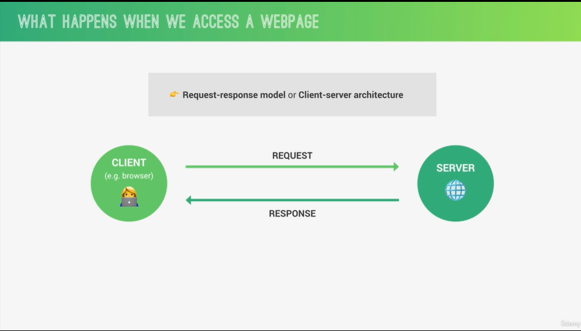
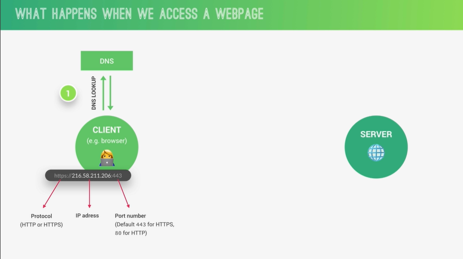
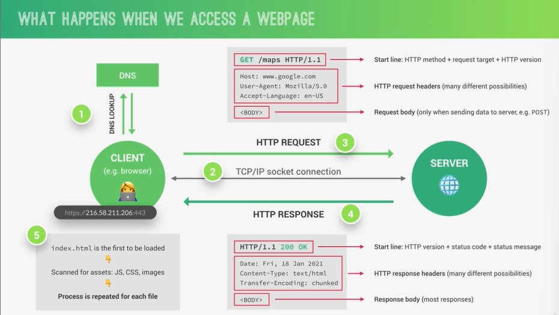
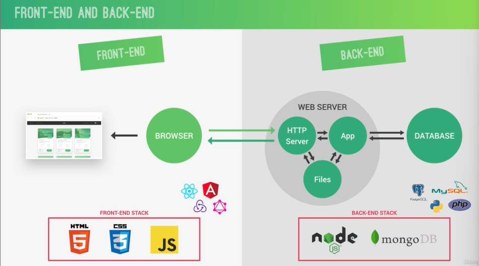
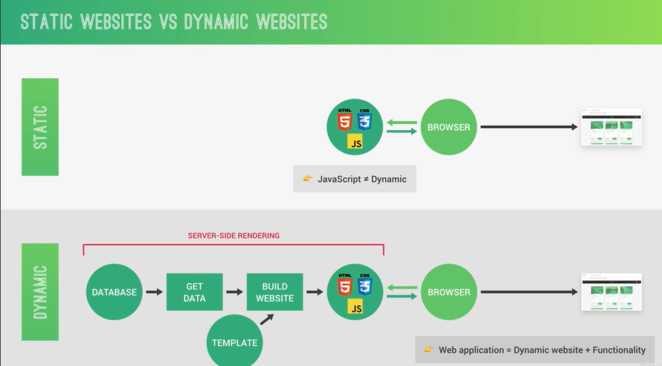
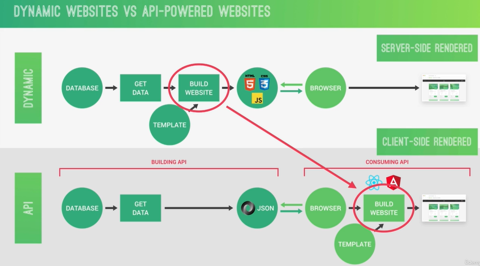
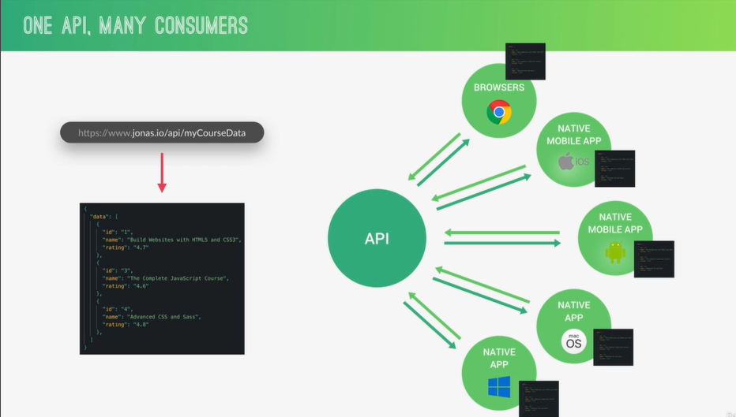

# INTRODUCTION TO BACK-END WEB DEVELOPMENT

#### AN OVERVIEW OF HOW THE WEB WORKS

##### What Happens when we access a web page

#### HTTP IN ACTION

#### FRONTEND VS BACK-END WEB DEVELOPMENT

#### STATIC WEBSITES VS DYNAMIC WEBSITES

#### DYNAMIC WEBSITES VS AN-POWERED WEBSITES

#### ONE MANY CONSUMERS

