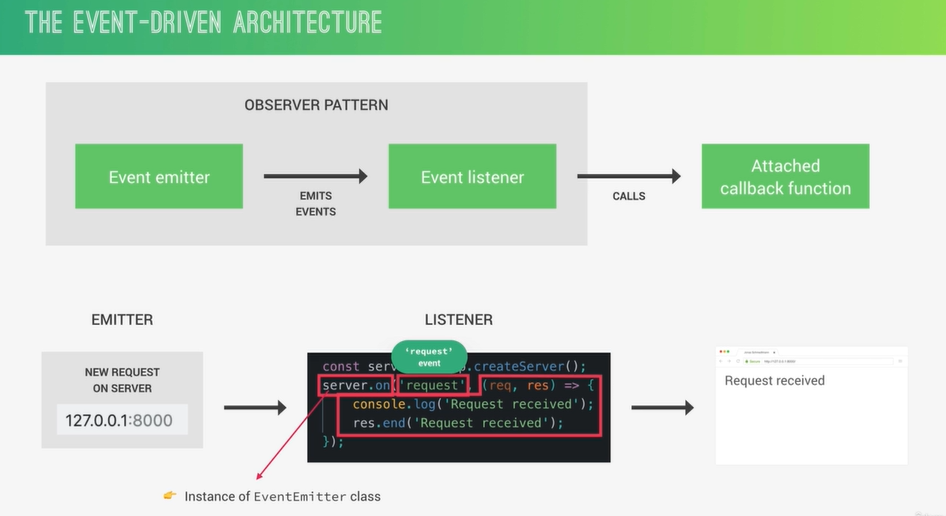

other resources (https://www.youtube.com/watch?v=L18RHG2DwwA&list=PLC3y8-rFHvwj1_l8acs_lBi3a0HNb3bAN&index=1)

# How Node.js Works A Look Behind the Scenes

#### THE NODE.JS ARCHITECTURE BEHIND THE SCENES


#### PROCESSES. THREADS AND THE THREAD POOL


#### THE NODE EVENT LOOP


#### THE EVENT LOOP IN DETAIL


#### SUMMARY OF THE EVENT LOOP: NODE VS. OTHERS


#### THE EVENT LOOP IN PRACTICE

```js
import fs from 'fs';

setTimeout(() => console.log('Timer 1 finished'), 0);
setImmediate(() => console.log('Immediate 1 finished'));

fs.readFile('test-file.txt', () => {
  console.log('I/O Finished');
  console.log('------------');
  setTimeout(() => console.log('Timer 2 finished'), 0);
  setTimeout(() => console.log('Timer 3 finished'), 3000);
  setImmediate(() => console.log('Immediate 2 finished'));

  process.nextTick(() => console.log('process.nextTick'));
});

console.log('hello from the top level code');

// output

// hello from the top level code
// Immediate 1 finished
// Timer 1 finished
// I/O Finished
// ------------
// process.nextTick
// Immediate 2 finished
// Timer 2 finished
// Timer 3 finished
```

```js
import fs from 'fs';
import crypto from 'crypto';

const start = Date.now();

// process.env.UV_THREADPOOL_SIZE = 1;

setTimeout(() => console.log('Timer 1 finished'), 0);
setImmediate(() => console.log('Immediate 1 finished'));

fs.readFile('test-file.txt', () => {
  console.log('I/O Finished');
  console.log('------------');
  setTimeout(() => console.log('Timer 2 finished'), 0);
  setTimeout(() => console.log('Timer 3 finished'), 3000);
  setImmediate(() => console.log('Immediate 2 finished'));

  process.nextTick(() => console.log('process.nextTick'));

  crypto.pbkdf2('password', 'salt', 100000, 1024, 'sha512', () => {
    console.log(Date.now() - start, 'Password encrypted');
  });
  crypto.pbkdf2('password', 'salt', 100000, 1024, 'sha512', () => {
    console.log(Date.now() - start, 'Password encrypted');
  });
  crypto.pbkdf2('password', 'salt', 100000, 1024, 'sha512', () => {
    console.log(Date.now() - start, 'Password encrypted');
  });
});

console.log('hello from the top level code');

// Output

// hello from the top level code
// Immediate 1 finished
// Timer 1 finished
// I/O Finished
// ------------
// process.nextTick
// Immediate 2 finished
// Timer 2 finished
// 1889 Password encrypted
// 1915 Password encrypted
// 2014 Password encrypted
// Timer 3 finished
```

#### EVENTS AND EVENT-DRIVEN ARCHITECTURE



#### EVENTS IN PRACTICE

```js
import EvenEmitter from 'events';
import http from 'http';

class Sales extends EvenEmitter {
  constructor() {
    super();
  }
}

const myEmitter = new Sales();

myEmitter.on('newSales', () => {
  console.log('There was a new sales!');
});
myEmitter.on('newSales', () => {
  console.log('Consumer name : L');
});

myEmitter.on('newSales', (stock) => {
  console.log(`Theres are now ${stock} items left in stock.`);
});

myEmitter.emit('newSales', 9);

////////////////////////////////////////

const server = http.createServer();

server.on('request', (req, res) => {
  console.log(`Request received:`);
  console.log(req.url);
  res.end('Request received');
});

server.on('request', (req, res) => {
  console.log(req.url);
  console.log('Another Request received');
});

server.on('close', (req, res) => {
  console.log('server closed');
});

server.listen(8000, '127.0.0.1', () => {
  console.log('Waiting for requests..... http://127.0.0.1:8000 ');
});
```

#### INTRODUCTION TO STREAMS

- Used to process (read and write) data piece by piece(chunks), without completing the whole read or write operation, and therefore without keeping all the data in memory.
- example: NETFLIX YOUTUBE.

- Perfect for handling large volumes of data, for example videos.

- More efficient data processing in terms of memory (no need to keep all data in memory) and time (we don't have to wait until all the data is available).

#### NODE.JS STREAMS FUNDAMENTALS


#### STREAMS IN PRACTICE

```js
import fs from 'fs';
import http from 'http';

const server = http.createServer();

server.on('request', (req, res) => {
  // Solution 1
  fs.readFile('test-file.txt', (err, data) => {
    if (err) console.log(err);
    res.end(data);
  });

  // Solution 2
  const readable = fs.createReadStream('test-file.txt');
  readable.on('data', (chuck) => {
    res.write(chuck);
  });

  readable.on('end', () => {
    res.end();
  });

  readable.on('error', (err) => {
    console.log(err);
    res.statusCode = 500;
    res.end('File not found');
  });

  // Solution 3
  const readable = fs.createReadStream('test-file.txt');
  readable.pipe(res); // readableSource.pipe(writeableDest)
});

server.listen(8000, '127.0.0.1', () => {
  console.log('listening on http://127.0.0.1:8000');
});
```

#### THE COMMONJS MODULE SYSTEM

- Each JavaScript file is treated as a separate module;
- Node.js uses the CommonJS module system: require( ), exports or module.exports;
- ES module system is used in browsers: import/export;
- There have been attempts to bring ES modules to node.js (.mjs).

#### WHAT HAPPENS WHEN WE REQUIRE() A MODULE


#### REWIRING MODULES IN PRACTICE

```js
const C = require('./test-module-1');
// const CC = require('./test-module-2');
const { add, mul, div } = require('./test-module-2');

const calc1 = new C();

console.log(calc1.add(5, 5));
// console.log(CC.add(5, 5));
console.log(add(5, 5));

// caching
require('./test-module-3')();
require('./test-module-3')();
require('./test-module-3')();

// Only In COMMON JS
// console.log(arguments);

// console.log(require('module').wrapper);

/**
[Arguments] {
  '0': {},
  '1': [Function: require] {
    resolve: [Function: resolve] { paths: [Function: paths] },
    main: {
      id: '.',
      path: 'C:\\Users\\Avinash\\OneDrive\\Desktop\\backend_node_express_mongodb\\src\\2-how-n
ode-works',
      exports: {},
      filename: 'C:\\Users\\Avinash\\OneDrive\\Desktop\\backend_node_express_mongodb\\src\\2-h
ow-node-works\\modules.js',
      loaded: false,
      children: [],
      paths: [Array]
    },
    extensions: [Object: null prototype] {
      '.js': [Function (anonymous)],
      '.json': [Function (anonymous)],
      '.node': [Function (anonymous)]
    },
    cache: [Object: null prototype] {
      'C:\\Users\\Avinash\\OneDrive\\Desktop\\backend_node_express_mongodb\\src\\2-how-node-wo
rks\\modules.js': [Object]
    }
  },
  '2': {
    id: '.',
    path: 'C:\\Users\\Avinash\\OneDrive\\Desktop\\backend_node_express_mongodb\\src\\2-how-nod
e-works',
    exports: {},
    filename: 'C:\\Users\\Avinash\\OneDrive\\Desktop\\backend_node_express_mongodb\\src\\2-how
-node-works\\modules.js',
    loaded: false,
    children: [],
    paths: [
      'C:\\Users\\Avinash\\OneDrive\\Desktop\\backend_node_express_mongodb\\src\\2-how-node-wo
rks\\node_modules',
      'C:\\Users\\Avinash\\OneDrive\\Desktop\\backend_node_express_mongodb\\src\\node_modules'
,
      'C:\\Users\\Avinash\\OneDrive\\Desktop\\backend_node_express_mongodb\\node_modules',    
      'C:\\Users\\Avinash\\OneDrive\\Desktop\\node_modules',
      'C:\\Users\\Avinash\\OneDrive\\node_modules',
      'C:\\Users\\Avinash\\node_modules',
      'C:\\Users\\node_modules',
      'C:\\node_modules'
    ]
  },
  '3': 'C:\\Users\\Avinash\\OneDrive\\Desktop\\backend_node_express_mongodb\\src\\2-how-node-w
orks\\modules.js',
  '4': 'C:\\Users\\Avinash\\OneDrive\\Desktop\\backend_node_express_mongodb\\src\\2-how-node-w
orks'
}


[
  '(function (exports, require, module, __filename, __dirname) { ',
  '\n});'
]
 */
```

```js
// class Calculator {
//   add(a, b) { return a + b }
//   mul(a, b) { return a * b }
//   div(a, b) { return a / b }
// }

// module.exports = Calculator;

module.exports = class {
  add(a, b) {
    return a + b;
  }
  mul(a, b) {
    return a * b;
  }
  div(a, b) {
    return a / b;
  }
};
```

```js
exports.add = (a, b) => a + b;
exports.mul = (a, b) => a * b;
exports.div = (a, b) => a / b;
```

```js
console.log('hello from the module');

module.exports = () => console.log('Log This beautiful text');
```
