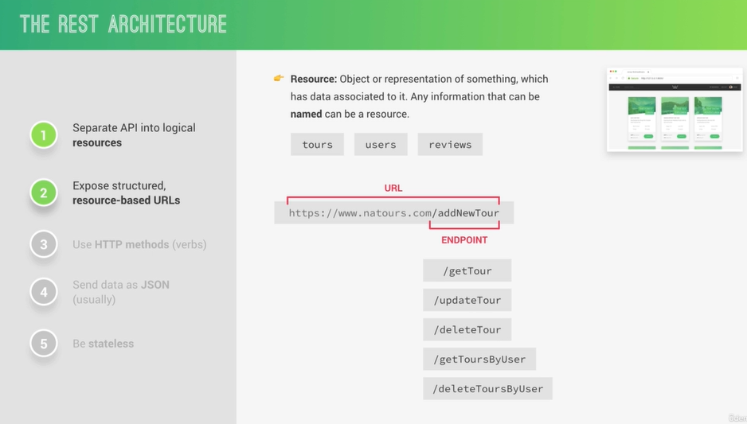
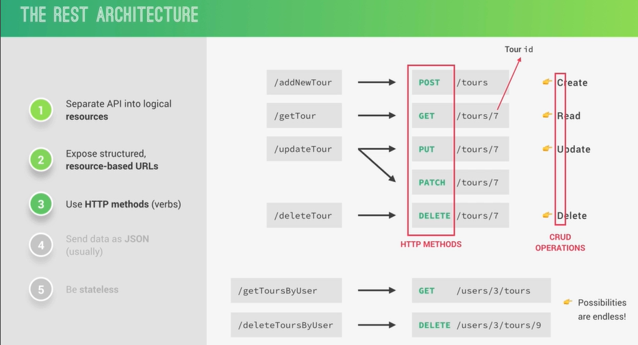
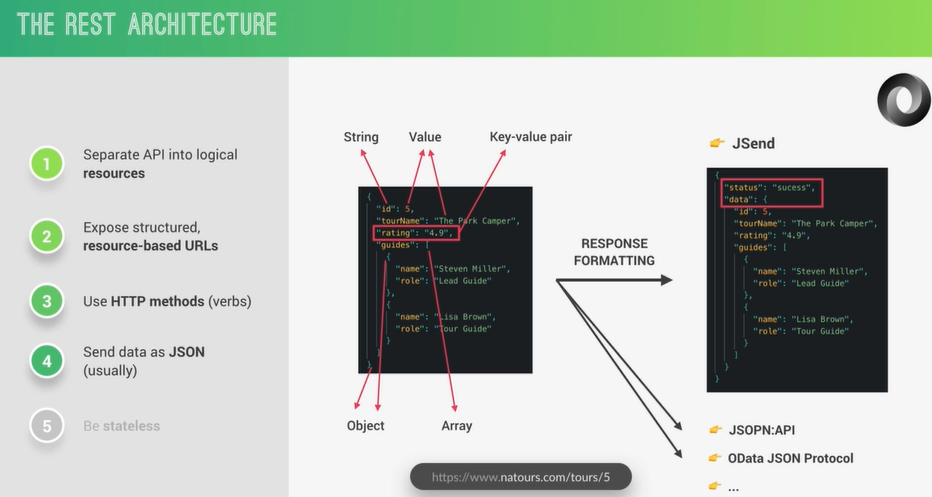
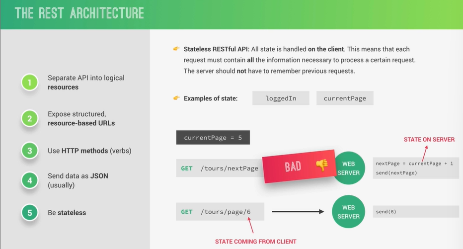
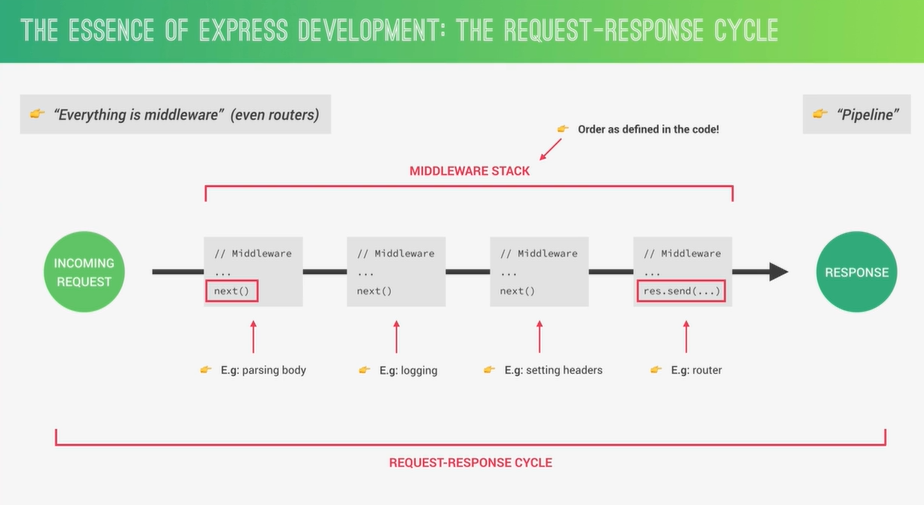

# Express Let's Start Building the Natours API!

#### WHAT IS EXPRESS?

- Express is a minimal node.js framework. a higher level of
  abstraction.

- Express contains a very robust set Of features:

  1. complex routing.
  2. easier handling of requests and responses.
  3. middleware.
  4. server-side rendering. etc.

- Express allows for rapid development of node.js
  applications: we don't have to re-invent the wheel.

- Express makes it easier to organize our application into the
  MVC architecture.

#### SETTING UP EXPRESS AND BASIC ROUTING

```js
import express from 'express';

const app = express();
const PORT = 8000;

app.get('/', (req, res) => {
  res.status(200).json({ message: 'Welcome to the server Side!' });
});

app.post('/', (req, res) => {
  res.status(200).json({ message: 'You can post to this endpoint..' });
});

app.listen(PORT, () => {
  console.log(`listening on http://127.0.0.1:${PORT}`);
});
```

#### APIS AND RESTFUL API DESIGN

##### API

- Application Programming Interface:
  a piece of software that can be used by another piece of software, in order to allow applications to talk to each other.

#### THE REST ARCHITECTURE






#### STARTING OUR API: HANDLING GET REQUESTS

```js
import express from 'express';
import fs from 'fs';
import { fileURLToPath } from 'url';
import { dirname } from 'path';

const __filename = fileURLToPath(import.meta.url);
const __dirname = dirname(__filename);

const app = express();
const PORT = 8000;

const tours = JSON.parse(
  fs.readFileSync(`${__dirname}/../dev-data/data/tours-simple.json`)
);

app.get('/api/v1/tours', (req, res) => {
  res.status(200).json({
    status: 'success',
    results: tours.length,
    data: { tours },
  });
});

app.listen(PORT, () => {
  console.log(`listening on http://127.0.0.1:${PORT}`);
});
```

#### HANDLING POST REQUESTS

```js
import express from 'express';
import fs from 'fs';
import { fileURLToPath } from 'url';
import { dirname } from 'path';

const __filename = fileURLToPath(import.meta.url);
const __dirname = dirname(__filename);

const app = express();
const PORT = 8000;

app.use(express.json());

const tours = JSON.parse(
  fs.readFileSync(`${__dirname}/../dev-data/data/tours-simple.json`)
);

app.get('/api/v1/tours', (req, res) => {
  res.status(200).json({
    status: 'success',
    results: tours.length,
    data: { tours },
  });
});

app.post('/api/v1/tours', (req, res) => {
  // console.log(req.body);

  const newId = tours[tours.length - 1].id + 1;
  const newTour = Object.assign({ id: newId }, req.body);

  tours.push(newTour);

  fs.writeFile(
    `${__dirname}/../dev-data/data/tours-simple.json`,
    JSON.stringify(tours),
    (err) =>
      res.status(201).json({
        status: 'success',
        data: { tours: newTour },
      })
  );
});

app.listen(PORT, () => {
  console.log(`listening on http://127.0.0.1:${PORT}`);
});
```

```js
// post  http://localhost:8000/api/v1/tours

// body->raw->JSON

//{
//    "name": "The Forest Hiker",
//    "duration": 5
//}

// {
//     "status": "success",
//     "data": {
//         "tours": {
//             "id": 9,
//             "name": "The Forest Hiker",
//             "duration": 5
//         }
//     }
// }
```

#### RESPONDING TO URL PARAMETERS

```js
import express from 'express';
import fs from 'fs';
import { fileURLToPath } from 'url';
import { dirname } from 'path';

const __filename = fileURLToPath(import.meta.url);
const __dirname = dirname(__filename);

const app = express();
const PORT = 8000;

app.use(express.json());

const tours = JSON.parse(
  fs.readFileSync(`${__dirname}/../dev-data/data/tours-simple.json`)
);

app.get('/api/v1/tours', (req, res) => {
  res.status(200).json({
    status: 'success',
    results: tours.length,
    data: { tours },
  });
});

app.get('/api/v1/tours/:id', (req, res) => {
  const id = req.params.id * 1;
  const tour = tours.find((el) => el.id === id);

  if (!tour) {
    return res.status(404).json({ status: 'error', message: 'Invalid ID' });
  }

  res.status(200).json({
    status: 'success',
    results: tours.length,
    data: { tour },
  });
});

app.post('/api/v1/tours', (req, res) => {
  // console.log(req.body);

  const newId = tours[tours.length - 1].id + 1;
  const newTour = Object.assign({ id: newId }, req.body);

  tours.push(newTour);

  fs.writeFile(
    `${__dirname}/../dev-data/data/tours-simple.json`,
    JSON.stringify(tours),
    (err) =>
      res.status(201).json({
        status: 'success',
        data: { tours: newTour },
      })
  );
});

app.listen(PORT, () => {
  console.log(`listening on http://127.0.0.1:${PORT}`);
});
```

#### HANDLING PATCH REQUESTS

```js
import express from 'express';
import fs from 'fs';
import { fileURLToPath } from 'url';
import { dirname } from 'path';

const __filename = fileURLToPath(import.meta.url);
const __dirname = dirname(__filename);

const app = express();
const PORT = 8000;

app.use(express.json());

const tours = JSON.parse(
  fs.readFileSync(`${__dirname}/../dev-data/data/tours-simple.json`)
);

app.get('/api/v1/tours', (req, res) => {
  res.status(200).json({
    status: 'success',
    results: tours.length,
    data: { tours },
  });
});

app.get('/api/v1/tours/:id', (req, res) => {
  const id = req.params.id * 1;
  const tour = tours.find((el) => el.id === id);

  if (!tour) {
    return res.status(404).json({ status: 'error', message: 'Invalid ID' });
  }

  res.status(200).json({
    status: 'success',
    results: tours.length,
    data: { tour },
  });
});

app.post('/api/v1/tours', (req, res) => {
  // console.log(req.body);

  const newId = tours[tours.length - 1].id + 1;
  const newTour = Object.assign({ id: newId }, req.body);

  tours.push(newTour);

  fs.writeFile(
    `${__dirname}/../dev-data/data/tours-simple.json`,
    JSON.stringify(tours),
    (err) =>
      res.status(201).json({
        status: 'success',
        data: { tours: newTour },
      })
  );
});

app.patch('/api/v1/tours/:id', (req, res) => {
  const id = req.params.id * 1;

  if (id > tours.length) {
    return res.status(404).json({ status: 'error', message: 'Invalid ID' });
  }

  res.status(200).json({
    status: 'success',
    data: {
      tour: '<update tour here...>',
    },
  });
});

app.listen(PORT, () => {
  console.log(`listening on http://127.0.0.1:${PORT}`);
});
```

#### HANDLING DELETE REQUESTS

```js
import express from 'express';
import fs from 'fs';
import { fileURLToPath } from 'url';
import { dirname } from 'path';

const __filename = fileURLToPath(import.meta.url);
const __dirname = dirname(__filename);

const app = express();
const PORT = 8000;

app.use(express.json());

const tours = JSON.parse(
  fs.readFileSync(`${__dirname}/../dev-data/data/tours-simple.json`)
);

app.get('/api/v1/tours', (req, res) => {
  res.status(200).json({
    status: 'success',
    results: tours.length,
    data: { tours },
  });
});

app.get('/api/v1/tours/:id', (req, res) => {
  const id = req.params.id * 1;
  const tour = tours.find((el) => el.id === id);

  if (!tour) {
    return res.status(404).json({ status: 'error', message: 'Invalid ID' });
  }

  res.status(200).json({
    status: 'success',
    results: tours.length,
    data: { tour },
  });
});

app.post('/api/v1/tours', (req, res) => {
  // console.log(req.body);

  const newId = tours[tours.length - 1].id + 1;
  const newTour = Object.assign({ id: newId }, req.body);

  tours.push(newTour);

  fs.writeFile(
    `${__dirname}/../dev-data/data/tours-simple.json`,
    JSON.stringify(tours),
    (err) =>
      res.status(201).json({
        status: 'success',
        data: { tours: newTour },
      })
  );
});

app.patch('/api/v1/tours/:id', (req, res) => {
  const id = req.params.id * 1;

  if (id > tours.length) {
    return res.status(404).json({ status: 'error', message: 'Invalid ID' });
  }

  res.status(200).json({
    status: 'success',
    data: {
      tour: '<update tour here...>',
    },
  });
});

app.delete('/api/v1/tours/:id', (req, res) => {
  const id = req.params.id * 1;

  if (id > tours.length) {
    return res.status(404).json({ status: 'error', message: 'Invalid ID' });
  }

  res.status(204).json({
    status: 'success',
    data: null,
  });
});

app.listen(PORT, () => {
  console.log(`listening on http://127.0.0.1:${PORT}`);
});
```

#### REFACTORING OUR ROUTES

```js
import express from 'express';
import fs from 'fs';
import { fileURLToPath } from 'url';
import { dirname } from 'path';

const __filename = fileURLToPath(import.meta.url);
const __dirname = dirname(__filename);

const app = express();
const PORT = 8000;

app.use(express.json());

const tours = JSON.parse(
  fs.readFileSync(`${__dirname}/../dev-data/data/tours-simple.json`)
);

const getALLTours = (req, res) => {
  res.status(200).json({
    status: 'success',
    results: tours.length,
    data: { tours },
  });
};

const getTourById = (req, res) => {
  const id = req.params.id * 1;
  const tour = tours.find((el) => el.id === id);

  if (!tour) {
    return res.status(404).json({ status: 'error', message: 'Invalid ID' });
  }

  res.status(200).json({
    status: 'success',
    results: tours.length,
    data: { tour },
  });
};

const createTour = (req, res) => {
  // console.log(req.body);

  const newId = tours[tours.length - 1].id + 1;
  const newTour = Object.assign({ id: newId }, req.body);

  tours.push(newTour);

  fs.writeFile(
    `${__dirname}/../dev-data/data/tours-simple.json`,
    JSON.stringify(tours),
    (err) =>
      res.status(201).json({
        status: 'success',
        data: { tours: newTour },
      })
  );
};

const updateTour = (req, res) => {
  const id = req.params.id * 1;

  if (id > tours.length) {
    return res.status(404).json({ status: 'error', message: 'Invalid ID' });
  }

  res.status(200).json({
    status: 'success',
    data: {
      tour: '<update tour here...>',
    },
  });
};

const deleteTour = (req, res) => {
  const id = req.params.id * 1;

  if (id > tours.length) {
    return res.status(404).json({ status: 'error', message: 'Invalid ID' });
  }

  res.status(204).json({
    status: 'success',
    data: null,
  });
};

// app.get('/api/v1/tours', getALLTours);
// app.get('/api/v1/tours/:id', getTourById);
// app.post('/api/v1/tours', createTour);
// app.patch('/api/v1/tours/:id', updateTour)
// app.delete('/api/v1/tours/:id', deleteTour)

app.route('/api/v1/tours').get(getALLTours).post(createTour);

app
  .route('/api/v1/tours/:id')
  .get(getTourById)
  .patch(updateTour)
  .delete(deleteTour);

app.listen(PORT, () => {
  console.log(`listening on http://127.0.0.1:${PORT}`);
});
```

#### MIDDLEWARE AND THE REQUEST-RESPONSE CYCLE



#### CREATE OWN MIDDLEWARE

```js
import express from 'express';
import fs from 'fs';
import { fileURLToPath } from 'url';
import { dirname } from 'path';

const __filename = fileURLToPath(import.meta.url);
const __dirname = dirname(__filename);

const app = express();
const PORT = 8000;

app.use(express.json());

const tours = JSON.parse(
  fs.readFileSync(`${__dirname}/../dev-data/data/tours-simple.json`)
);

// middleware
app.use((req, res, next) => {
  console.log('hello from the middleware');
  next();
});
// middleware
app.use((req, res, next) => {
  req.requestTime = new Date().toISOString();
  next();
});

const getALLTours = (req, res) => {
  console.log(req.requestTime);
  res.status(200).json({
    status: 'success',
    time: req.requestTime,
    results: tours.length,
    data: { tours },
  });
};

const getTourById = (req, res) => {
  const id = req.params.id * 1;
  const tour = tours.find((el) => el.id === id);

  if (!tour) {
    return res.status(404).json({ status: 'error', message: 'Invalid ID' });
  }

  res.status(200).json({
    status: 'success',
    results: tours.length,
    data: { tour },
  });
};

const createTour = (req, res) => {
  // console.log(req.body);

  const newId = tours[tours.length - 1].id + 1;
  const newTour = Object.assign({ id: newId }, req.body);

  tours.push(newTour);

  fs.writeFile(
    `${__dirname}/../dev-data/data/tours-simple.json`,
    JSON.stringify(tours),
    (err) =>
      res.status(201).json({
        status: 'success',
        data: { tours: newTour },
      })
  );
};

const updateTour = (req, res) => {
  const id = req.params.id * 1;

  if (id > tours.length) {
    return res.status(404).json({ status: 'error', message: 'Invalid ID' });
  }

  res.status(200).json({
    status: 'success',
    data: {
      tour: '<update tour here...>',
    },
  });
};

const deleteTour = (req, res) => {
  const id = req.params.id * 1;

  if (id > tours.length) {
    return res.status(404).json({ status: 'error', message: 'Invalid ID' });
  }

  res.status(204).json({
    status: 'success',
    data: null,
  });
};

// app.get('/api/v1/tours', getALLTours);
// app.get('/api/v1/tours/:id', getTourById);
// app.post('/api/v1/tours', createTour);
// app.patch('/api/v1/tours/:id', updateTour)
// app.delete('/api/v1/tours/:id', deleteTour)

app.route('/api/v1/tours').get(getALLTours).post(createTour);

app
  .route('/api/v1/tours/:id')
  .get(getTourById)
  .patch(updateTour)
  .delete(deleteTour);

app.listen(PORT, () => {
  console.log(`listening on http://127.0.0.1:${PORT}`);
});
```

#### USING 3RD-PARTY MIDDLEWARE

```bash
 npm i morgan
```

```js
import express from 'express';
import morgan from 'morgan';
import fs from 'fs';
import { fileURLToPath } from 'url';
import { dirname } from 'path';

const __filename = fileURLToPath(import.meta.url);
const __dirname = dirname(__filename);

const app = express();
const PORT = 8000;

const tours = JSON.parse(
  fs.readFileSync(`${__dirname}/../dev-data/data/tours-simple.json`)
);

app.use(express.json());
app.use(morgan('dev'));

// middleware
app.use((req, res, next) => {
  // console.log("hello from the middleware");
  next();
});
// middleware
app.use((req, res, next) => {
  req.requestTime = new Date().toISOString();
  next();
});

const getALLTours = (req, res) => {
  // console.log(req.requestTime);
  res.status(200).json({
    status: 'success',
    time: req.requestTime,
    results: tours.length,
    data: { tours },
  });
};

const getTourById = (req, res) => {
  const id = req.params.id * 1;
  const tour = tours.find((el) => el.id === id);

  if (!tour) {
    return res.status(404).json({ status: 'error', message: 'Invalid ID' });
  }

  res.status(200).json({
    status: 'success',
    results: tours.length,
    data: { tour },
  });
};

const createTour = (req, res) => {
  // console.log(req.body);

  const newId = tours[tours.length - 1].id + 1;
  const newTour = Object.assign({ id: newId }, req.body);

  tours.push(newTour);

  fs.writeFile(
    `${__dirname}/../dev-data/data/tours-simple.json`,
    JSON.stringify(tours),
    (err) =>
      res.status(201).json({
        status: 'success',
        data: { tours: newTour },
      })
  );
};

const updateTour = (req, res) => {
  const id = req.params.id * 1;

  if (id > tours.length) {
    return res.status(404).json({ status: 'error', message: 'Invalid ID' });
  }

  res.status(200).json({
    status: 'success',
    data: {
      tour: '<update tour here...>',
    },
  });
};

const deleteTour = (req, res) => {
  const id = req.params.id * 1;

  if (id > tours.length) {
    return res.status(404).json({ status: 'error', message: 'Invalid ID' });
  }

  res.status(204).json({
    status: 'success',
    data: null,
  });
};

// app.get('/api/v1/tours', getALLTours);
// app.get('/api/v1/tours/:id', getTourById);
// app.post('/api/v1/tours', createTour);
// app.patch('/api/v1/tours/:id', updateTour)
// app.delete('/api/v1/tours/:id', deleteTour)

app.route('/api/v1/tours').get(getALLTours).post(createTour);

app
  .route('/api/v1/tours/:id')
  .get(getTourById)
  .patch(updateTour)
  .delete(deleteTour);

app.listen(PORT, () => {
  console.log(`listening on http://127.0.0.1:${PORT}`);
});
```

#### IMPLEMENTING THE "USERS" ROUTES

```js
import express from 'express';
import morgan from 'morgan';
import fs from 'fs';
import { fileURLToPath } from 'url';
import { dirname } from 'path';

const __filename = fileURLToPath(import.meta.url);
const __dirname = dirname(__filename);

const app = express();
const PORT = 8000;

const tours = JSON.parse(
  fs.readFileSync(`${__dirname}/../dev-data/data/tours-simple.json`)
);

app.use(express.json());
app.use(morgan('dev'));

// middleware
app.use((req, res, next) => {
  // console.log("hello from the middleware");
  next();
});
// middleware
app.use((req, res, next) => {
  req.requestTime = new Date().toISOString();
  next();
});

//! TOURs
const getALLTours = (req, res) => {
  // console.log(req.requestTime);
  res.status(200).json({
    status: 'success',
    time: req.requestTime,
    results: tours.length,
    data: { tours },
  });
};

const getTourById = (req, res) => {
  const id = req.params.id * 1;
  const tour = tours.find((el) => el.id === id);

  if (!tour) {
    return res.status(404).json({ status: 'error', message: 'Invalid ID' });
  }

  res.status(200).json({
    status: 'success',
    results: tours.length,
    data: { tour },
  });
};

const createTour = (req, res) => {
  // console.log(req.body);

  const newId = tours[tours.length - 1].id + 1;
  const newTour = Object.assign({ id: newId }, req.body);

  tours.push(newTour);

  fs.writeFile(
    `${__dirname}/../dev-data/data/tours-simple.json`,
    JSON.stringify(tours),
    (err) =>
      res.status(201).json({
        status: 'success',
        data: { tours: newTour },
      })
  );
};

const updateTour = (req, res) => {
  const id = req.params.id * 1;

  if (id > tours.length) {
    return res.status(404).json({ status: 'error', message: 'Invalid ID' });
  }

  res.status(200).json({
    status: 'success',
    data: {
      tour: '<update tour here...>',
    },
  });
};

const deleteTour = (req, res) => {
  const id = req.params.id * 1;

  if (id > tours.length) {
    return res.status(404).json({ status: 'error', message: 'Invalid ID' });
  }

  res.status(204).json({
    status: 'success',
    data: null,
  });
};

// ! User
const getAllUsers = (req, res) => {
  res.status(500).json({
    status: 'error',
    message: 'This routes is nto yet defined',
  });
};
const getUserById = (req, res) => {
  res.status(500).json({
    status: 'error',
    message: 'This routes is nto yet defined',
  });
};
const createUser = (req, res) => {
  res.status(500).json({
    status: 'error',
    message: 'This routes is nto yet defined',
  });
};
const updateUser = (req, res) => {
  res.status(500).json({
    status: 'error',
    message: 'This routes is nto yet defined',
  });
};
const deleteUser = (req, res) => {
  res.status(500).json({
    status: 'error',
    message: 'This routes is nto yet defined',
  });
};

// app.get('/api/v1/tours', getALLTours);
// app.get('/api/v1/tours/:id', getTourById);
// app.post('/api/v1/tours', createTour);
// app.patch('/api/v1/tours/:id', updateTour)
// app.delete('/api/v1/tours/:id', deleteTour)

app.route('/api/v1/tours').get(getALLTours).post(createTour);

app
  .route('/api/v1/tours/:id')
  .get(getTourById)
  .patch(updateTour)
  .delete(deleteTour);

app.route('/api/v1/users').get(getAllUsers).post(createUser);

app
  .route('/api/v1/users/:id')
  .get(getUserById)
  .patch(updateUser)
  .delete(deleteUser);

app.listen(PORT, () => {
  console.log(`listening on http://127.0.0.1:${PORT}`);
});
```

#### CREATING AND MOUNTING MULTIPLE ROUTERS

```js
import express from 'express';
import morgan from 'morgan';
import fs from 'fs';
import { fileURLToPath } from 'url';
import { dirname } from 'path';

const __filename = fileURLToPath(import.meta.url);
const __dirname = dirname(__filename);

const app = express();
const PORT = 8000;

const tours = JSON.parse(
  fs.readFileSync(`${__dirname}/../dev-data/data/tours-simple.json`)
);

app.use(express.json());
app.use(morgan('dev'));

// middleware
app.use((req, res, next) => {
  // console.log("hello from the middleware");
  next();
});
// middleware
app.use((req, res, next) => {
  req.requestTime = new Date().toISOString();
  next();
});

//! TOURs
const getALLTours = (req, res) => {
  // console.log(req.requestTime);
  res.status(200).json({
    status: 'success',
    time: req.requestTime,
    results: tours.length,
    data: { tours },
  });
};

const getTourById = (req, res) => {
  const id = req.params.id * 1;
  const tour = tours.find((el) => el.id === id);

  if (!tour) {
    return res.status(404).json({ status: 'error', message: 'Invalid ID' });
  }

  res.status(200).json({
    status: 'success',
    results: tours.length,
    data: { tour },
  });
};

const createTour = (req, res) => {
  // console.log(req.body);

  const newId = tours[tours.length - 1].id + 1;
  const newTour = Object.assign({ id: newId }, req.body);

  tours.push(newTour);

  fs.writeFile(
    `${__dirname}/../dev-data/data/tours-simple.json`,
    JSON.stringify(tours),
    (err) =>
      res.status(201).json({
        status: 'success',
        data: { tours: newTour },
      })
  );
};

const updateTour = (req, res) => {
  const id = req.params.id * 1;

  if (id > tours.length) {
    return res.status(404).json({ status: 'error', message: 'Invalid ID' });
  }

  res.status(200).json({
    status: 'success',
    data: {
      tour: '<update tour here...>',
    },
  });
};

const deleteTour = (req, res) => {
  const id = req.params.id * 1;

  if (id > tours.length) {
    return res.status(404).json({ status: 'error', message: 'Invalid ID' });
  }

  res.status(204).json({
    status: 'success',
    data: null,
  });
};

// ! User
const getAllUsers = (req, res) => {
  res.status(500).json({
    status: 'error',
    message: 'This routes is nto yet defined',
  });
};
const getUserById = (req, res) => {
  res.status(500).json({
    status: 'error',
    message: 'This routes is nto yet defined',
  });
};
const createUser = (req, res) => {
  res.status(500).json({
    status: 'error',
    message: 'This routes is nto yet defined',
  });
};
const updateUser = (req, res) => {
  res.status(500).json({
    status: 'error',
    message: 'This routes is nto yet defined',
  });
};
const deleteUser = (req, res) => {
  res.status(500).json({
    status: 'error',
    message: 'This routes is nto yet defined',
  });
};

// app.get('/api/v1/tours', getALLTours);
// app.get('/api/v1/tours/:id', getTourById);
// app.post('/api/v1/tours', createTour);
// app.patch('/api/v1/tours/:id', updateTour)
// app.delete('/api/v1/tours/:id', deleteTour)

const tourRouter = express.Router();

tourRouter.route('/').get(getALLTours).post(createTour);

tourRouter.route('/:id').get(getTourById).patch(updateTour).delete(deleteTour);

const usersRouter = express.Router();

usersRouter.route('/').get(getAllUsers).post(createUser);

usersRouter.route('/:id').get(getUserById).patch(updateUser).delete(deleteUser);

app.use('/api/v1/tours', tourRouter);
app.use('/api/v1/users', usersRouter);

app.listen(PORT, () => {
  console.log(`listening on http://127.0.0.1:${PORT}`);
});
```

#### A BETTER FILE STRUCTURE

```js
//server.js
import { app } from './app.js';

const PORT = 8000;

app.listen(PORT, () => {
  console.log(`listening on http://127.0.0.1:${PORT}`);
});
```

```js
// app.js
import express from 'express';
import morgan from 'morgan';

const app = express();

app.use(express.json());
app.use(morgan('dev'));

// middleware
app.use((req, res, next) => {
  // console.log("hello from the middleware");
  next();
});
// middleware
app.use((req, res, next) => {
  req.requestTime = new Date().toISOString();
  next();
});

import tourRouter from './routes/tours.routes.js';
import usersRouter from './routes/users.routes.js';

app.use('/api/v1/tours', tourRouter);
app.use('/api/v1/users', usersRouter);

export { app };
```

```js
// users.routes.js
import express from 'express';

import {
  getAllUsers,
  getUserById,
  createUser,
  updateUser,
  deleteUser,
} from '../controllers/users.controller.js';

const router = express.Router();

router.route('/').get(getAllUsers).post(createUser);

router.route('/:id').get(getUserById).patch(updateUser).delete(deleteUser);

export default router;
```

```js
// users.controller.js

const getAllUsers = (req, res) => {
  res.status(500).json({
    status: 'error',
    message: 'This routes is nto yet defined',
  });
};
const getUserById = (req, res) => {
  res.status(500).json({
    status: 'error',
    message: 'This routes is nto yet defined',
  });
};
const createUser = (req, res) => {
  res.status(500).json({
    status: 'error',
    message: 'This routes is nto yet defined',
  });
};
const updateUser = (req, res) => {
  res.status(500).json({
    status: 'error',
    message: 'This routes is nto yet defined',
  });
};
const deleteUser = (req, res) => {
  res.status(500).json({
    status: 'error',
    message: 'This routes is nto yet defined',
  });
};

export { getAllUsers, getUserById, createUser, updateUser, deleteUser };
```

```js
// tours.routes.js

import express from 'express';

import {
  getALLTours,
  getTourById,
  createTour,
  updateTour,
  deleteTour,
} from '../controllers/tours.controller.js';

const router = express.Router();

router.route('/').get(getALLTours).post(createTour);

router.route('/:id').get(getTourById).patch(updateTour).delete(deleteTour);

export default router;
```

```js
// tours.controller.js

import fs from 'fs';
import { fileURLToPath } from 'url';
import { dirname } from 'path';

const __filename = fileURLToPath(import.meta.url);
const __dirname = dirname(__filename);

export const tours = JSON.parse(
  fs.readFileSync(`${__dirname}/../../dev-data/data/tours-simple.json`)
);

//! TOURs
const getALLTours = (req, res) => {
  // console.log(req.requestTime);
  res.status(200).json({
    status: 'success',
    time: req.requestTime,
    results: tours.length,
    data: { tours },
  });
};

const getTourById = (req, res) => {
  const id = req.params.id * 1;
  const tour = tours.find((el) => el.id === id);

  if (!tour) {
    return res.status(404).json({ status: 'error', message: 'Invalid ID' });
  }

  res.status(200).json({
    status: 'success',
    results: tours.length,
    data: { tour },
  });
};

const createTour = (req, res) => {
  // console.log(req.body);

  const newId = tours[tours.length - 1].id + 1;
  const newTour = Object.assign({ id: newId }, req.body);

  tours.push(newTour);

  fs.writeFile(
    `${__dirname}/../dev-data/data/tours-simple.json`,
    JSON.stringify(tours),
    (err) =>
      res.status(201).json({
        status: 'success',
        data: { tours: newTour },
      })
  );
};

const updateTour = (req, res) => {
  const id = req.params.id * 1;

  if (id > tours.length) {
    return res.status(404).json({ status: 'error', message: 'Invalid ID' });
  }

  res.status(200).json({
    status: 'success',
    data: {
      tour: '<update tour here...>',
    },
  });
};

const deleteTour = (req, res) => {
  const id = req.params.id * 1;

  if (id > tours.length) {
    return res.status(404).json({ status: 'error', message: 'Invalid ID' });
  }

  res.status(204).json({
    status: 'success',
    data: null,
  });
};

export { getALLTours, getTourById, createTour, updateTour, deleteTour };
```

#### PARAM MIDDLEWARE

```js
// tours.routes.js

import express from 'express';

import {
  getALLTours,
  getTourById,
  createTour,
  updateTour,
  deleteTour,
  checkId,
} from '../controllers/tours.controller.js';

const router = express.Router();

router.param('id', checkId);

router.route('/').get(getALLTours).post(createTour);

router.route('/:id').get(getTourById).patch(updateTour).delete(deleteTour);

export default router;
```

```js
// tours.controller.js

import fs from 'fs';
import { fileURLToPath } from 'url';
import { dirname } from 'path';

const __filename = fileURLToPath(import.meta.url);
const __dirname = dirname(__filename);

export const tours = JSON.parse(
  fs.readFileSync(`${__dirname}/../../dev-data/data/tours-simple.json`)
);

const checkId = (req, res, next, val) => {
  console.log(`Tour id is in controller : ${val}`);
  const id = req.params.id * 1;

  if (id > tours.length) {
    return res.status(404).json({
      status: 'error',
      message: 'Invalid ID',
    });
  }

  next();
};

//! TOURs
const getALLTours = (req, res) => {
  // console.log(req.requestTime);
  res.status(200).json({
    status: 'success',
    time: req.requestTime,
    results: tours.length,
    data: { tours },
  });
};

const getTourById = (req, res) => {
  const id = req.params.id * 1;
  const tour = tours.find((el) => el.id === id);

  res.status(200).json({
    status: 'success',
    results: tours.length,
    data: { tour },
  });
};

const createTour = (req, res) => {
  // console.log(req.body);

  const newId = tours[tours.length - 1].id + 1;
  const newTour = Object.assign({ id: newId }, req.body);

  tours.push(newTour);

  fs.writeFile(
    `${__dirname}/../dev-data/data/tours-simple.json`,
    JSON.stringify(tours),
    (err) =>
      res.status(201).json({
        status: 'success',
        data: { tours: newTour },
      })
  );
};

const updateTour = (req, res) => {
  res.status(200).json({
    status: 'success',
    data: {
      tour: '<update tour here...>',
    },
  });
};

const deleteTour = (req, res) => {
  res.status(204).json({
    status: 'success',
    data: null,
  });
};

export {
  getALLTours,
  getTourById,
  createTour,
  updateTour,
  deleteTour,
  checkId,
};
```

#### CHAINING MULTIPLE MIDDLEWARE FUNCTIONS

```js
import express from 'express';

import {
  getALLTours,
  getTourById,
  createTour,
  updateTour,
  deleteTour,
  checkId,
} from '../controllers/tours.controller.js';

const router = express.Router();

router.param('id', checkId); // params id middleware

router.route('/').get(getALLTours).post(createTour);

router.route('/:id').get(getTourById).patch(updateTour).delete(deleteTour);

export default router;
```

```js
import fs from 'fs';
import { fileURLToPath } from 'url';
import { dirname } from 'path';

const __filename = fileURLToPath(import.meta.url);
const __dirname = dirname(__filename);

export const tours = JSON.parse(
  fs.readFileSync(`${__dirname}/../../dev-data/data/tours-simple.json`)
);

// Params id middleware handler
const checkId = (req, res, next, val) => {
  console.log(`Tour id is in controller : ${val}`);
  const id = req.params.id * 1;

  if (id > tours.length) {
    return res.status(404).json({
      status: 'error',
      message: 'Invalid ID',
    });
  }

  next();
};

//! TOURs
const getALLTours = (req, res) => {
  // console.log(req.requestTime);
  res.status(200).json({
    status: 'success',
    time: req.requestTime,
    results: tours.length,
    data: { tours },
  });
};

const getTourById = (req, res) => {
  const id = req.params.id * 1;
  const tour = tours.find((el) => el.id === id);

  res.status(200).json({
    status: 'success',
    results: tours.length,
    data: { tour },
  });
};

const createTour = (req, res) => {
  // console.log(req.body);

  const newId = tours[tours.length - 1].id + 1;
  const newTour = Object.assign({ id: newId }, req.body);

  tours.push(newTour);

  fs.writeFile(
    `${__dirname}/../dev-data/data/tours-simple.json`,
    JSON.stringify(tours),
    (err) =>
      res.status(201).json({
        status: 'success',
        data: { tours: newTour },
      })
  );
};

const updateTour = (req, res) => {
  res.status(200).json({
    status: 'success',
    data: {
      tour: '<update tour here...>',
    },
  });
};

const deleteTour = (req, res) => {
  res.status(204).json({
    status: 'success',
    data: null,
  });
};

export {
  getALLTours,
  getTourById,
  createTour,
  updateTour,
  deleteTour,
  checkId,
};
```

#### SERVING STATIC FILES

```js
import express from 'express';
import morgan from 'morgan';

import { fileURLToPath } from 'url';
import { dirname } from 'path';

const __filename = fileURLToPath(import.meta.url);
const __dirname = dirname(__filename);

const app = express();

app.use(express.json());

app.use(morgan('dev'));

// static files
app.use(express.static(`${__dirname}/../public/`));

// middleware
app.use((req, res, next) => {
  // console.log("hello from the middleware");
  next();
});
// middleware
app.use((req, res, next) => {
  req.requestTime = new Date().toISOString();
  next();
});

import tourRouter from './routes/tours.routes.js';
import usersRouter from './routes/users.routes.js';

app.use('/api/v1/tours', tourRouter);
app.use('/api/v1/users', usersRouter);

export { app };
```

#### ENVIRONMENT VARIABLES

```bash
npm install dotenv
```

```js
NODE_ENV = development;
PORT = 8000;
USER = luffy;
PASSWORD = 12345;
```

```js
// server.js

import dotenv from 'dotenv';
dotenv.config({ path: './config.env' });
import { app } from './app.js';

// console.log(app.get('env'));
console.log(process.env);
console.log(process.env.PORT);

const PORT = process.env.PORT || 8000;

app.listen(PORT, () => {
  console.log(`listening on http://127.0.0.1:${PORT}`);
});
```

#### SETTING UP ES LINT + PRETTIER IN VSCODE

```bash
npm i eslint prettier eslint-config-prettier eslint-plugin-prettier eslint-config-airbnb eslint-plugin-node eslint-plugin-import eslint-plugin-jsx-a11y  eslint-plugin-react --save-dev
```

````js
//.eslintrc.json
{
  "extends": [
    "airbnb",
    "prettier",
    "plugin:node/recommended"
  ],
  "plugins": [
    "prettier"
  ],
  "rules": {
    "prettier/prettier": "error",
    "spaced-comment": "off",
    "no-console": "warn",
    "consistent-return": "off",
    "func-names": "off",
    "object-shorthand": "off",
    "no-process-exit": "off",
    "no-param-reassign": "off",
    "no-return-await": "off",
    "no-underscore-dangle": "off",
    "class-methods-use-this": "off",
    "prefer-destructuring": [
      "error",
      {
        "object": true,
        "array": false
      }
    ],
    "no-unused-vars": [
      "error",
      {
        "argsIgnorePattern": "req|res|next|val"
      }
    ]
  }
}
```

####
````
