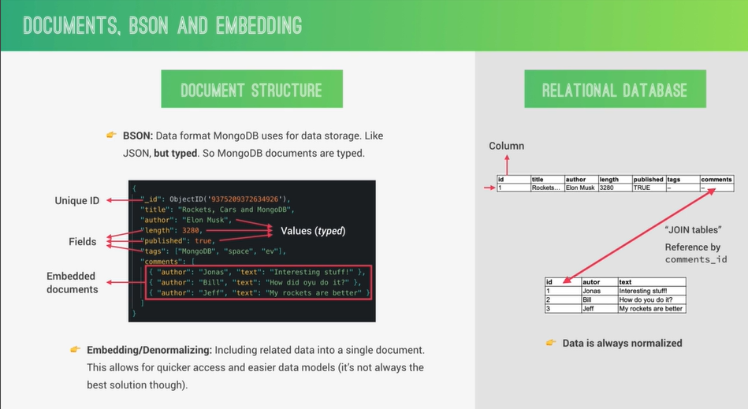

# INTRODUCTION TO MONGODB

#### WHAT IS MONGODB?

- MongoDB is a document database with the scalability and flexibility that you want with the querying and indexing that you need.

##### KEY MONGODB FEATURES:

- **Document based:** MongoDB stores data in documents (field-value pair data structures, NoSQL).

- **Scalable:** Very easy to distribute data across multiple machines as your users and amount of data grows.

- **Flexible:** No document data schema required. so each document can have different number and type Of fields.

- **Performant:** Embedded data models, indexing, sharding, flexible documents, native duplication, etc.

- Free and open-source, published under the SSPL License.

##### DOCUMENTS, BSON AND EMBEDDING



#### CREATING A LOCAL DATABASE

```bash

mongosh

use natours-test
# switched to db natours-test

natours-test> db.tours.insertOne({name:"THe Forest Hiker", price:297,rating:4.7})

natours-test> db.tours.find({})

natours-test> show dbs

natours-test> show collections
```

#### CRUD: CREATING DOCUMENTS

```bash
test> db.tours.insertMany([
  {
  "name": "The Sea Explorer",
  price:497,
  rating:4.8
  },
  {
  name:"the Snow adventure",
  price:997,
  rating:4.9, difficulty:"easy"
  }
])

# {
#   acknowledged: true,
#   insertedIds: {
#     '0': ObjectId("662b6ba90f17d89bef20915c"),
#     '1': ObjectId("662b6ba90f17d89bef20915d")
#   }
# }

# test> db.tours.find({})
# [
#   {
#     _id: ObjectId("662b6ba90f17d89bef20915c"),
#     name: 'The Sea Explorer',
#     price: 497,
#     rating: 4.8
#   },
#   {
#     _id: ObjectId("662b6ba90f17d89bef20915d"),
#     name: 'the Snow adventer',
#     price: 997,
#     rating: 4.9,
#     difficulty: 'easy'
#   }
# ]
```

#### CRUD: QUERYING (READING) DOCUMENTS

```bash
test> db.tours.find({ name:"the Snow adventer"})
# [
#   {
#     _id: ObjectId("662b6ba90f17d89bef20915d"),
#     name: 'the Snow adventer',
#     price: 997,
#     rating: 4.9,
#     difficulty: 'easy'
#   }
# ]

test> db.tours.find({price: {$lte:500}})  $lte-> less then eq
# [
#   {
#     _id: ObjectId("662b6ba90f17d89bef20915c"),
#     name: 'The Sea Explorer',
#     price: 497,
#     rating: 4.8
#   }
# ]

test> db.tours.find({price: {$lte:500},rating:{$gte:4.8}  })
# [
#   {
#     _id: ObjectId("662b6ba90f17d89bef20915c"),
#     name: 'The Sea Explorer',
#     price: 497,
#     rating: 4.8
#   }
# ]

test> db.tours.find({ $or: [{price:{$lt:500}},{rating:{$gte:4.8}}]})
# [
#   {
#     _id: ObjectId("662b6ba90f17d89bef20915c"),
#     name: 'The Sea Explorer',
#     price: 497,
#     rating: 4.8
#   },
#   {
#     _id: ObjectId("662b6ba90f17d89bef20915d"),
#     name: 'the Snow adventer',
#     price: 997,
#     rating: 4.9,
#     difficulty: 'easy'
#   }
# ]


test> db.tours.find({ $or: [{price:{$lt:500}},{rating:{$gte:4.8}}]} , {name:1})
# [
#   {
#     _id: ObjectId("662b6ba90f17d89bef20915c"),
#     name: 'The Sea Explorer'
#   },
#   {
#     _id: ObjectId("662b6ba90f17d89bef20915d"),
#     name: 'the Snow adventer'
#   }
# ]
```

#### CRUD: UPDATING DOCUMENTS

```bash
test> db.tours.updateOne({ name: "The Sea Explorer"  } , { $set : {price:599} } )
# {
#   acknowledged: true,
#   insertedId: null,
#   matchedCount: 1,
#   modifiedCount: 1,
#   upsertedCount: 0
# }
test> db.tours.find()
# [
#   {
#     _id: ObjectId("662b6ba90f17d89bef20915c"),
#     name: 'The Sea Explorer',
#     price: 599,
#     rating: 4.8
#   },
#   {
#     _id: ObjectId("662b6ba90f17d89bef20915d"),
#     name: 'the Snow adventer',
#     price: 997,
#     rating: 4.9,
#     difficulty: 'easy'
#   }
# ]

test> db.tours.updateAMany({ name: "The Sea Explorer"  } , { $set : {premium:true} } )
```

#### CRUD: DELETING DOCUMENTS

```bash
test> db.tours.deleteMany({rating:{$lt:4.8}})
# { acknowledged: true, deletedCount: 0 }
test> db.tours.find()
# [
#   {
#     _id: ObjectId("662b6ba90f17d89bef20915c"),
#     name: 'The Sea Explorer',
#     price: 599,
#     rating: 4.8
#   },
#   {
#     _id: ObjectId("662b6ba90f17d89bef20915d"),
#     name: 'the Snow adventer',
#     price: 997,
#     rating: 4.9,
#     difficulty: 'easy'
#   }
# ]
```
