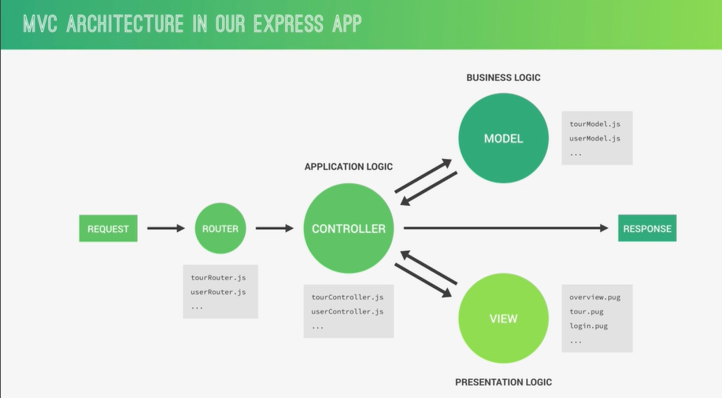
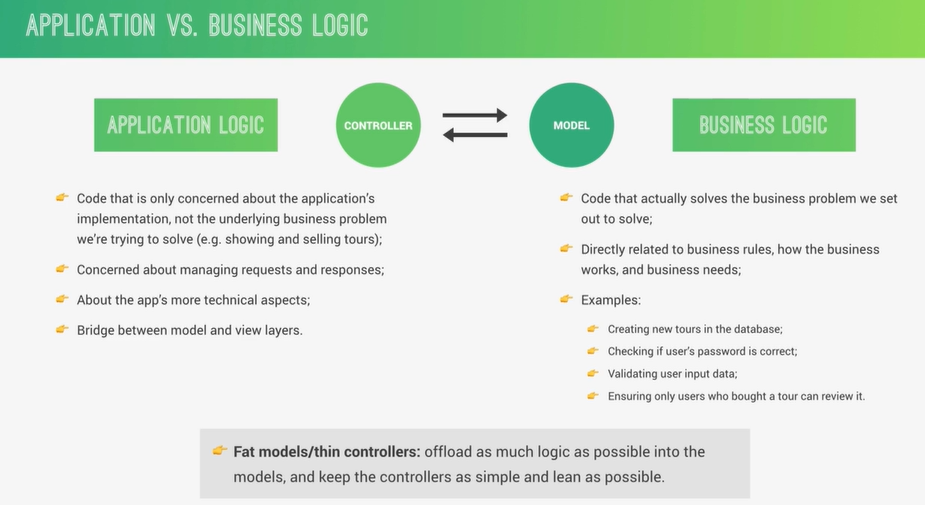

# Using MongoDB with Mongoose

#### CONNECTING OUR DATABASE WITH THE EXPRESS APP

```bash

MONGODB_URL=mongodb+srv://<username>:<password>@cluster0.88ziaql.mongodb.net/

MONGODB_URL_LOCAL=mongodb://localhost:27017/natours
```

```js
import dotenv from 'dotenv';
import mongoose from 'mongoose';
import { app } from './app.js';

dotenv.config();

mongoose
  .connect(process.env.MONGODB_URL)
  // .connect(process.env.MONGODB_URL_LOCAL)
  .then((con) =>
    console.log(con.connection.host + ' is Connected to Mongo DB')
  );

const PORT = process.env.PORT || 8000;

app.listen(PORT, () => {
  console.log(`listening on http://127.0.0.1:${PORT}`);
});

// console.log(app.get('env'));
// console.log(process.env);
// console.log(process.env.PORT);

// mongoose.connect(process.env.MONGODB_URL)
//   .then((con) => {
//     console.log(con.connection.port)
//     console.log(con.connection.models)
//     console.log(con.connection.host)
//     console.log(con.connection.name)
//   });
```

#### WHAT IS MONGOOSE?

##### WHAT IS MONGOOSE. AND WHY USE IT?

- Mongoose is an Object Data Modeling (ODM) library for MongoDB and Node.js. a higher level of abstraction.

- Mongoose allows for rapid and simple development of mongoDB database interactions.

- Features: schemas to model data and relationships. easy data validation. simple query API. middleware. etc.

- Mongoose schema: where we model our data, by describing the structure of the data, default values, and validation.

- Mongoose model: a wrapper for the schema, providing an
  interface to the database for CRUD operations.

- SCHEMA => MODEL

#### CREATING A SIMPLE TOUR MODEL

```js
// server.js

import dotenv from 'dotenv';
import mongoose from 'mongoose';
import { app } from './app.js';

dotenv.config();

mongoose // .connect(process.env.MONGODB_URL_LOCAL)
  .connect(process.env.MONGODB_URL)
  .then((con) =>
    console.log(con.connection.host + ' is Connected to Mongo DB')
  );

const tourSchema = new mongoose.Schema({
  name: {
    type: String,
    required: [true, 'A tour must have a name'],
    unique: true,
  },
  price: { type: Number, required: [true, 'A tour must have a price'] },
  rating: { type: Number, default: 4.5 },
});

const Tour = mongoose.model('Tour', tourSchema);

const PORT = process.env.PORT || 8000;

app.listen(PORT, () => {
  console.log(`listening on http://127.0.0.1:${PORT}`);
});

// console.log(app.get('env'));
// console.log(process.env);
// console.log(process.env.PORT);

// mongoose.connect(process.env.MONGODB_URL)
//   .then((con) => {
//     console.log(con.connection.port)
//     console.log(con.connection.models)
//     console.log(con.connection.host)
//     console.log(con.connection.name)
//   });
```

#### CREATING DOCUMENTS AND TESTING THE MODEL

```js
import dotenv from 'dotenv';
import mongoose from 'mongoose';
import { app } from './app.js';

dotenv.config();

mongoose
  .connect(process.env.MONGODB_URL_LOCAL)
  // .connect(process.env.MONGODB_URL)
  .then((con) =>
    console.log(con.connection.host + ' is Connected to Mongo DB')
  );

const tourSchema = new mongoose.Schema({
  name: {
    type: String,
    required: [true, 'A tour must have a name'],
    unique: true,
  },
  price: { type: Number, required: [true, 'A tour must have a price'] },
  rating: { type: Number, default: 4.5 },
});

const Tour = mongoose.model('Tour', tourSchema);

const testTour = new Tour({
  name: 'The Park and Forest Hiker',
  price: 497,
  rating: 4.7,
});

testTour
  .save()
  .then((document) => console.log(document))
  .catch((error) => console.log(error.message));

const PORT = process.env.PORT || 8000;

app.listen(PORT, () => {
  console.log(`listening on http://127.0.0.1:${PORT}`);
});

// console.log(app.get('env'));
// console.log(process.env);
// console.log(process.env.PORT);

// mongoose.connect(process.env.MONGODB_URL)
//   .then((con) => {
//     console.log(con.connection.port)
//     console.log(con.connection.models)
//     console.log(con.connection.host)
//     console.log(con.connection.name)
//   });
```

#### Intro to Back-End Architecture MVC, Types of Logic, and More





#### REFACTORING FOR MVC

```js
import dotenv from 'dotenv';
import mongoose from 'mongoose';
import { app } from './app.js';
import { Tour } from './model/tour.model.js';

dotenv.config();

mongoose
  .connect(process.env.MONGODB_URL_LOCAL)
  // .connect(process.env.MONGODB_URL)
  .then((con) =>
    console.log(con.connection.host + ' is Connected to Mongo DB')
  );

// const testTour = new Tour({
//   name: 'The Parks and Forest Hiker',
//   price: 497,
//   rating: 4.7,
// })

// testTour
//   .save()
//   .then(document => console.log(document))
//   .catch(error => console.log(error.message))

const PORT = process.env.PORT || 8000;

app.listen(PORT, () => {
  console.log(`listening on http://127.0.0.1:${PORT}`);
});

// console.log(app.get('env'));
// console.log(process.env);
// console.log(process.env.PORT);

// mongoose.connect(process.env.MONGODB_URL)
//   .then((con) => {
//     console.log(con.connection.port)
//     console.log(con.connection.models)
//     console.log(con.connection.host)
//     console.log(con.connection.name)
//   });
```

```js
//  model/tour.model.js
import mongoose from 'mongoose';

const tourSchema = new mongoose.Schema({
  name: {
    type: String,
    required: [true, 'A tour must have a name'],
    unique: true,
  },
  price: { type: Number, required: [true, 'A tour must have a price'] },
  rating: { type: Number, default: 4.5 },
});

export const Tour = mongoose.model('Tour', tourSchema);
```

#### ANOTHER WAY OF CREATING DOCUMENTS

```js
const createTour = async (req, res) => {
  try {
    const newTour = await Tour.create(req.body);

    res.status(201).json({
      status: 'success',
      data: { tour: newTour },
    });
  } catch (error) {
    res.status(404).json({
      status: 'fail',
      message: 'INvalid data sent',
    });
  }
};
```

#### READING DOCUMENTS

```js
const getALLTours = async (req, res) => {
  try {
    const tours = await Tour.find();

    res.status(200).json({
      status: 'success',
      results: tours.length,
      data: { tours },
    });
  } catch (error) {
    res.status(404).json({
      status: 'error',
      message: error,
    });
  }
};

const getTourById = async (req, res) => {
  const id = req.params.id;
  try {
    const tours = await Tour.findById(id);
    // const tours = await Tour.findOne({ _id: id });

    res.status(200).json({
      status: 'success',
      data: { tours },
    });
  } catch (error) {
    res.status(404).json({
      status: 'error',
      message: error.message,
    });
  }
};
```

#### UPDATING DOCUMENTS

```js
const updateTour = async (req, res) => {
  const id = req.params.id;
  try {
    const tours = await Tour.findByIdAndUpdate(id, req.body, {
      new: true,
      runValidators: true,
    });

    res.status(200).json({
      status: 'success',
      data: { tours },
    });
  } catch (error) {
    res.status(404).json({
      status: 'error',
      message: error.message,
    });
  }
};
```

#### DELETING DOCUMENTS

```js
const deleteTour = async (req, res) => {
  const id = req.params.id;
  try {
    const tours = await Tour.findByIdAndDelete(id);

    res.status(204).json({
      status: 'success',
      data: { tours },
    });
  } catch (error) {
    res.status(404).json({
      status: 'error',
      message: error.message,
    });
  }
};
```

#### MODELLING THE TOURS

```js
import mongoose from 'mongoose';

const tourSchema = new mongoose.Schema({
  name: {
    type: String,
    required: [true, 'A tour must have a name'],
    unique: true,
    trim: true,
  },
  duration: {
    type: Number,
    required: [true, 'A tour must have a duration'],
  },
  maxGroupSize: {
    type: Number,
    required: [true, 'A tour must have a group size'],
  },
  difficulty: {
    type: String,
    required: [true, 'A tour must have a difficulty'],
  },
  ratingsAverage: {
    type: Number,
    default: 0,
  },
  ratingsQuantity: {
    type: Number,
    default: 0,
  },
  price: {
    type: Number,
    required: [true, 'A tour must have a price'],
  },
  priceDiscount: {
    type: Number,
  },
  summary: {
    type: String,
    required: [true, 'A tour must have a summary'],
    trim: true,
  },
  description: {
    type: String,
    required: [true, 'A tour must have a description'],
  },
  imageCover: {
    type: String,
    required: [true, 'A tour must have a cover image'],
  },
  images: [{ type: String }],
  createdAt: { type: Date, default: Date.now() },
  startDates: [{ type: Date }],
});

export const Tour = mongoose.model('Tour', tourSchema);
```

#### IMPORTING DEVELOPMENT DATA

```js
import dotenv from 'dotenv';
dotenv.config();

import mongoose from 'mongoose';
import { Tour } from './../../src/model/tour.model.js';

import fs from 'fs';
import { fileURLToPath } from 'url';
import { dirname } from 'path';

const __filename = fileURLToPath(import.meta.url);
const __dirname = dirname(__filename);

mongoose
  .connect(process.env.MONGODB_URL_LOCAL)
  // .connect(process.env.MONGODB_URL)
  .then((con) =>
    console.log(con.connection.host + ' is Connected to Mongo DB')
  );

const tours = JSON.parse(
  fs.readFileSync(`${__dirname}/tours-simple.json`, 'utf8')
);

// IMPORTING ALL DATA FROM DB
const importData = async () => {
  try {
    await Tour.create(tours);
    console.log('Data Successfully imported');
  } catch (error) {
    console.log(error);
  }
  process.exit();
};

// DELETE ALL DATA FROM DB
const deleteData = async () => {
  try {
    await Tour.deleteMany();
    console.log('Data  Successfully delete');
  } catch (error) {
    console.log(error);
  }
  process.exit();
};

if (process.argv[2] === '--import') {
  importData();
}
if (process.argv[2] === '--delete') {
  deleteData();
}
console.log(process.argv);
```

#### MAKING THE API BETTER: FILTERING

```js
const getALLTours = async (req, res) => {
  try {
    // BUILD QUERY
    const queryObj = { ...req.query };
    const excludedFields = ['page', 'sort', 'limit', 'fields'];

    excludedFields.forEach((el) => delete queryObj[el]);

    // console.log(req.query, queryObj);
    // const tours = await Tour.find()
    //   .where("duration")
    //   .equals(5)
    //   .where("difficulty")
    //   .equals('easy')

    const query = Tour.find(queryObj);

    // EXECUTE QUERY
    const tours = await query;

    res.status(200).json({
      status: 'success',
      results: tours.length,
      data: { tours },
    });
  } catch (error) {
    res.status(404).json({
      status: 'error',
      message: error,
    });
  }
};
```

#### MAKING THE API BETTER: ADVANCED FILTERING

```js
const getALLTours = async (req, res) => {
  try {
    console.log(req.query);
    // BUILD QUERY

    // 1)Filtering
    const queryObj = { ...req.query };
    const excludedFields = ['page', 'sort', 'limit', 'fields'];

    excludedFields.forEach((el) => delete queryObj[el]);

    // 2) Advanced Filtering

    let queryStr = JSON.stringify(queryObj);
    queryStr = queryStr.replace(/\b(gte|gt|lte|lt)\b/g, (match) => `$${match}`);

    console.log(JSON.parse(queryStr));

    const query = Tour.find(JSON.parse(queryStr));

    // EXECUTE QUERY
    const tours = await query;

    res.status(200).json({
      status: 'success',
      results: tours.length,
      data: { tours },
    });
  } catch (error) {
    res.status(404).json({
      status: 'error',
      message: error,
    });
  }
};
```

#### MAKING THE API BETTER: SORTING

```js
const getALLTours = async (req, res) => {
  try {
    console.log(req.query);
    // BUILD QUERY

    // 1A)Filtering
    const queryObj = { ...req.query };
    const excludedFields = ['page', 'sort', 'limit', 'fields'];

    excludedFields.forEach((el) => delete queryObj[el]);

    // 1B) Advanced Filtering
    let queryStr = JSON.stringify(queryObj);
    queryStr = queryStr.replace(/\b(gte|gt|lte|lt)\b/g, (match) => `$${match}`);
    // console.log(JSON.parse(queryStr));

    let query = Tour.find(JSON.parse(queryStr)).select('price');

    // 2) Sorting
    if (req.query.sort) {
      const sortBy = req.query.sort.split(',').join(' ');
      console.log(sortBy);
      query = query.sort(sortBy); // sort("price ratingsAverage")
    } else {
      query = query.sort('-createdAt');
    }

    // EXECUTE QUERY
    const tours = await query;

    res.status(200).json({
      status: 'success',
      results: tours.length,
      data: { tours },
    });
  } catch (error) {
    res.status(404).json({
      status: 'error',
      message: error,
    });
  }
};
```

#### MAKING THE API BETTER: LIMITING FIELDS

```js
const getALLTours = async (req, res) => {
  try {
    console.log(req.query);
    // BUILD QUERY

    // 1A)Filtering
    const queryObj = { ...req.query };
    const excludedFields = ['page', 'sort', 'limit', 'fields'];

    excludedFields.forEach((el) => delete queryObj[el]);

    // 1B) Advanced Filtering
    let queryStr = JSON.stringify(queryObj);
    queryStr = queryStr.replace(/\b(gte|gt|lte|lt)\b/g, (match) => `$${match}`);
    // console.log(JSON.parse(queryStr));

    let query = Tour.find(JSON.parse(queryStr));
    // .select("price");

    // 2) Sorting
    if (req.query.sort) {
      const sortBy = req.query.sort.split(',').join(' ');
      console.log(sortBy);
      query = query.sort(sortBy); // sort("price ratingsAverage")
    } else {
      query = query.sort('-createdAt');
    }

    // 3) limit
    if (req.query.fields) {
      const fields = req.query.fields.split(',').join(' ');
      query = query.select(fields); // select("name duration price")
    } else {
      query = query.select('-__v');
    }

    // EXECUTE QUERY
    const tours = await query;

    res.status(200).json({
      status: 'success',
      results: tours.length,
      data: { tours },
    });
  } catch (error) {
    res.status(404).json({
      status: 'error',
      message: error,
    });
  }
};
```

#### MAKING THE API BETTER: PAGINATION

```js
const getALLTours = async (req, res) => {
  try {
    console.log(req.query);
    // BUILD QUERY

    // 1A)Filtering
    const queryObj = { ...req.query };
    const excludedFields = ['page', 'sort', 'limit', 'fields'];

    excludedFields.forEach((el) => delete queryObj[el]);

    // 1B) Advanced Filtering
    let queryStr = JSON.stringify(queryObj);
    queryStr = queryStr.replace(/\b(gte|gt|lte|lt)\b/g, (match) => `$${match}`);
    // console.log(JSON.parse(queryStr));

    let query = Tour.find(JSON.parse(queryStr)).select('name');

    // 2) Sorting
    if (req.query.sort) {
      const sortBy = req.query.sort.split(',').join(' ');
      console.log(sortBy);
      query = query.sort(sortBy); // sort("price ratingsAverage")
    } else {
      query = query.sort('-createdAt');
    }

    // 3) limit
    if (req.query.fields) {
      const fields = req.query.fields.split(',').join(' ');
      query = query.select(fields); // select("name duration price")
    } else {
      query = query.select('-__v');
    }

    // 4) Pagination

    //pag=2&limit=10  -> 1-10, page 1 , 11-20 ,page 2 , 21-30
    // query = query.skip(10).limit(10)

    const page = req.query.page * 1 || 1;
    const limit = req.query.limit * 1 || 100;
    const skip = (page - 1) * limit;

    query = query.skip(skip).limit(limit);

    if (req.query.page) {
      const numTours = await Tour.countDocuments();

      if (skip >= numTours) {
        throw new Error('This page does not exist');
      }
    }

    // EXECUTE QUERY
    const tours = await query;

    res.status(200).json({
      status: 'success',
      results: tours.length,
      data: { tours },
    });
  } catch (error) {
    res.status(404).json({
      status: 'error',
      message: error,
    });
  }
};
```

#### MAKING THE API BETTER: ALIASING

```js
router.route('/top-5-cheap').get(aliasTopTours, getALLTours);

// ! middleware
const aliasTopTours = async (req, res, next) => {
  req.query.limit = '5';
  req.query.sort = '-ratingsAverage,price';
  req.query.fields = 'name,price,ratingsAverage,summary,difficulty';

  next();
};

//http://localhost:8000/api/v1/tours?limit=5&sort=-ratingsAverage,price
```

#### REFACTORING API FEATURES

```js
class APIFeatures {
  constructor(query, queryString) {
    this.query = query;
    this.queryString = queryString;
  }

  filter() {
    // 1A)Filtering
    const queryObj = { ...this.queryString };
    const excludedFields = ['page', 'sort', 'limit', 'fields'];

    excludedFields.forEach((el) => delete queryObj[el]);

    // 1B) Advanced Filtering
    let queryStr = JSON.stringify(queryObj);
    queryStr = queryStr.replace(/\b(gte|gt|lte|lt)\b/g, (match) => `$${match}`);

    this.query = this.query.find(JSON.parse(queryStr));

    return this;
  }

  sort() {
    // 2) Sorting
    if (this.queryString.sort) {
      const sortBy = this.queryString.sort.split(',').join(' ');
      this.query = this.query.sort(sortBy);
    } else {
      this.query = this.query.sort('-createdAt');
    }
    return this;
  }

  limitFields() {
    // 3) limit
    if (this.queryString.fields) {
      const fields = this.queryString.fields.split(',').join(' ');
      this.query = this.query.select(fields);
    } else {
      this.query = this.query.select('-__v');
    }
    return this;
  }

  paginate() {
    // 4) Pagination

    //pag=2&limit=10  -> 1-10, page 1 , 11-20 ,page 2 , 21-30
    // query = query.skip(10).limit(10)

    const page = this.queryString.page * 1 || 1;
    const limit = this.queryString.limit * 1 || 100;
    const skip = (page - 1) * limit;

    this.query = this.query.skip(skip).limit(limit);

    return this;
  }
}

//! TOURs
const getALLTours = async (req, res) => {
  try {
    console.log(req.query);
    // BUILD QUERY

    // 1A)Filtering
    // const queryObj = { ...req.query }
    // const excludedFields = ['page', 'sort', 'limit', 'fields']

    // excludedFields.forEach(el => delete queryObj[el])

    // // 1B) Advanced Filtering
    // let queryStr = JSON.stringify(queryObj);
    // queryStr = queryStr.replace(/\b(gte|gt|lte|lt)\b/g, match => `$${match}`)
    // // console.log(JSON.parse(queryStr));

    // let query = Tour.find(JSON.parse(queryStr))
    // .select("name");

    // // 2) Sorting
    // if (req.query.sort) {
    //   const sortBy = req.query.sort.split(',').join(' ')
    //   console.log(sortBy);
    //   query = query.sort(sortBy);  // sort("price ratingsAverage")
    // } else {
    //   query = query.sort("-createdAt");
    // }

    // // 3) limit
    // if (req.query.fields) {
    //   const fields = req.query.fields.split(',').join(' ');
    //   query = query.select(fields)  // select("name duration price")
    // } else {
    //   query = query.select("-__v");
    // }

    // // 4) Pagination

    // //pag=2&limit=10  -> 1-10, page 1 , 11-20 ,page 2 , 21-30
    // // query = query.skip(10).limit(10)

    // const page = req.query.page * 1 || 1;
    // const limit = req.query.limit * 1 || 100;
    // const skip = (page - 1) * limit;

    // query = query.skip(skip).limit(limit)

    // if (req.query.page) {
    //   const numTours = await Tour.countDocuments()

    //   if (skip >= numTours) {
    //     throw new Error("This page does not exist")
    //   }
    // }

    // EXECUTE QUERY
    const features = new APIFeatures(Tour.find(), req.query)
      .filter()
      .sort()
      .limitFields()
      .paginate();

    const tours = await features.query;

    res.status(200).json({
      status: 'success',
      results: tours.length,
      data: { tours },
    });
  } catch (error) {
    res.status(404).json({
      status: 'error',
      message: error,
    });
  }
};
```

#### AGGREGATION PIPELINE: MATCHING AND GROUPING

```js
// AGGREGATION PIPELINE: MATCHING AND GROUPING

const getTourStats = async (req, res) => {
  try {
    const stats = await Tour.aggregate([
      {
        $match: { ratingsAverage: { $gte: 4.5 } },
      },
      {
        $group: {
          _id: { $toUpper: '$difficulty' },
          // _id: '$ratingsAverage',
          numTours: { $sum: 1 },
          numRating: { $avg: '$ratingsQuantity' },
          avgRating: { $avg: '$ratingsAverage' },
          avgPrice: { $avg: '$price' },
          minPrice: { $min: '$price' },
          maxPrice: { $min: '$price' },
        },
      },
      {
        $sort: { avgPrice: 1 },
      },
      // {
      //   $match: { _id: { $ne: 'EASY' } }
      // }
    ]);

    res.status(200).json({
      status: 'success',
      data: { stats },
    });
  } catch (error) {
    res.status(404).json({ status: 'error', message: error.message });
  }
};
```

#### AGGREGATION PIPELINE: UNWINDING AND PROJECTING

```js
const getMonthlyPlan = async (req, res) => {
  try {
    const year = req.params.year * 1; //  __ * 1 -> thick convert into number

    const plan = await Tour.aggregate([
      { $unwind: '$startDates' },
      {
        $match: {
          startDates: {
            $gte: new Date(`${year}-01-01`),
            $lte: new Date(`${year}-12-31`),
          },
        },
      },
      {
        $group: {
          _id: { $month: '$startDates' },
          numTourStarts: { $sum: 1 },
          tours: { $push: '$name' },
        },
      },
      { $addFields: { month: '$_id' } },
      { $project: { _id: 0 } },
      { $sort: { numTourStarts: -1 } },
      { $limit: 12 },
    ]);

    res.status(200).json({
      status: 'success',
      data: { plan },
    });
  } catch (error) {
    res.status(404).json({ status: 'error', message: error.message });
  }
};
```

#### VIRTUAL PROPERTIES

```js
import mongoose from 'mongoose';

const tourSchema = new mongoose.Schema(
  {
    name: {
      type: String,
      required: [true, 'A tour must have a name'],
      unique: true,
      trim: true,
    },
    duration: {
      type: Number,
      required: [true, 'A tour must have a duration'],
    },
    maxGroupSize: {
      type: Number,
      required: [true, 'A tour must have a group size'],
    },
    difficulty: {
      type: String,
      required: [true, 'A tour must have a difficulty'],
    },
    ratingsAverage: {
      type: Number,
      default: 0,
    },
    ratingsQuantity: {
      type: Number,
      default: 0,
    },
    price: {
      type: Number,
      required: [true, 'A tour must have a price'],
    },
    priceDiscount: {
      type: Number,
    },
    summary: {
      type: String,
      required: [true, 'A tour must have a summary'],
      trim: true,
    },
    description: {
      type: String,
      required: [true, 'A tour must have a description'],
    },
    imageCover: {
      type: String,
      required: [true, 'A tour must have a cover image'],
    },
    images: [{ type: String }],
    createdAt: { type: Date, default: Date.now() },
    startDates: [{ type: Date }],
  },
  {
    toJSON: { virtuals: true },
    toObject: { virtuals: true },
  }
);

tourSchema.virtual(`durationWeeks`).get(function () {
  return this.duration / 7;
});

export const Tour = mongoose.model('Tour', tourSchema);
```

#### DOCUMENT MIDDLEWARE OR HOOKS

```js
import mongoose from 'mongoose';
import slugify from 'slugify';

const tourSchema = new mongoose.Schema(
  {
    name: {
      type: String,
      required: [true, 'A tour must have a name'],
      unique: true,
      trim: true,
    },
    slug: {
      type: String,
    },
    duration: {
      type: Number,
      required: [true, 'A tour must have a duration'],
    },
    maxGroupSize: {
      type: Number,
      required: [true, 'A tour must have a group size'],
    },
    difficulty: {
      type: String,
      required: [true, 'A tour must have a difficulty'],
    },
    ratingsAverage: {
      type: Number,
      default: 0,
    },
    ratingsQuantity: {
      type: Number,
      default: 0,
    },
    price: {
      type: Number,
      required: [true, 'A tour must have a price'],
    },
    priceDiscount: {
      type: Number,
    },
    summary: {
      type: String,
      required: [true, 'A tour must have a summary'],
      trim: true,
    },
    description: {
      type: String,
      required: [true, 'A tour must have a description'],
    },
    imageCover: {
      type: String,
      required: [true, 'A tour must have a cover image'],
    },
    images: [{ type: String }],
    createdAt: { type: Date, default: Date.now() },
    startDates: [{ type: Date }],
  },
  {
    toJSON: { virtuals: true },
    toObject: { virtuals: true },
  }
);

tourSchema.virtual(`durationWeeks`).get(function () {
  return this.duration / 7;
});

// DOCUMENT MIDDLEWARE :Runs before .save() and .create()
// .save() is called hooks or middleware.
tourSchema.pre('save', function (next) {
  // console.log(this);
  this.slug = slugify(this.name, { lower: true });
  next();
});

// tourSchema.pre('save', function (next) {
//   console.log('Will save Document');

//   next();
// })

// tourSchema.post('save', function (doc, next) {
//   console.log(doc);
//   next();
// })

export const Tour = mongoose.model('Tour', tourSchema);
```

#### QUERY MIDDLEWARE

```js
import mongoose from 'mongoose';
import slugify from 'slugify';

const tourSchema = new mongoose.Schema(
  {
    name: {
      type: String,
      required: [true, 'A tour must have a name'],
      unique: true,
      trim: true,
    },
    slug: {
      type: String,
    },
    duration: {
      type: Number,
      required: [true, 'A tour must have a duration'],
    },
    maxGroupSize: {
      type: Number,
      required: [true, 'A tour must have a group size'],
    },
    difficulty: {
      type: String,
      required: [true, 'A tour must have a difficulty'],
    },
    ratingsAverage: {
      type: Number,
      default: 0,
    },
    ratingsQuantity: {
      type: Number,
      default: 0,
    },
    price: {
      type: Number,
      required: [true, 'A tour must have a price'],
    },
    priceDiscount: {
      type: Number,
    },
    summary: {
      type: String,
      required: [true, 'A tour must have a summary'],
      trim: true,
    },
    description: {
      type: String,
      required: [true, 'A tour must have a description'],
    },
    imageCover: {
      type: String,
      required: [true, 'A tour must have a cover image'],
    },
    images: [{ type: String }],
    createdAt: { type: Date, default: Date.now() },
    startDates: [{ type: Date }],
    secretTour: { type: Boolean, default: false },
  },
  {
    toJSON: { virtuals: true },
    toObject: { virtuals: true },
  }
);

tourSchema.virtual(`durationWeeks`).get(function () {
  return this.duration / 7;
});

// DOCUMENT MIDDLEWARE :Runs before .save() and .create()
// .save() is called hooks or middleware.
tourSchema.pre('save', function (next) {
  // console.log(this);
  this.slug = slugify(this.name, { lower: true });
  next();
});

// tourSchema.pre('save', function (next) {
//   console.log('Will save Document');

//   next();
// })

// tourSchema.post('save', function (doc, next) {
//   console.log(doc);
//   next();
// })

// QUERY MIDDLEWARE
tourSchema.pre(/^find/, function (next) {
  this.find({ secretTour: { $ne: true } });

  this.start = Date.now();
  next();
});

tourSchema.post(/^find/, function (docs, next) {
  console.log(`Query took ${Date.now() - this.start} milliseconds`);
  // console.log(docs);
  next();
});

export const Tour = mongoose.model('Tour', tourSchema);
```

#### AGGREGATION MIDDLEWARE

```js
// AGGREGATION MIDDLEWARE
tourSchema.pre('aggregate', function (next) {
  this.pipeline().unshift({ $match: { secretTour: { $ne: true } } });
  console.log(this.pipeline());
  next();
});
```

#### DATA VALIDATION : BUILT-IN VALIDATORS

```js
import mongoose from 'mongoose';
import slugify from 'slugify';

const tourSchema = new mongoose.Schema(
  {
    name: {
      type: String,
      required: [true, 'A tour must have a name'],
      unique: true,
      trim: true,
      maxlength: [40, 'A tour must have a less or equal then 40 characters'],
      minlength: [3, 'A tour must have a less or equal then 40 characters'],
    },
    slug: {
      type: String,
    },
    duration: {
      type: Number,
      required: [true, 'A tour must have a duration'],
    },
    maxGroupSize: {
      type: Number,
      required: [true, 'A tour must have a group size'],
    },
    difficulty: {
      type: String,
      required: [true, 'A tour must have a difficulty'],
      enum: {
        values: ['easy', 'medium', 'difficult'],
        message: 'Difficulty is either: easy, medium, difficult',
      },
    },
    ratingsAverage: {
      type: Number,
      default: 0,
      min: [1, 'Rating must be above 1.0'],
      max: [1, 'Rating must be below 5.0'],
    },
    ratingsQuantity: {
      type: Number,
      default: 0,
    },
    price: {
      type: Number,
      required: [true, 'A tour must have a price'],
    },
    priceDiscount: {
      type: Number,
    },
    summary: {
      type: String,
      required: [true, 'A tour must have a summary'],
      trim: true,
    },
    description: {
      type: String,
      required: [true, 'A tour must have a description'],
    },
    imageCover: {
      type: String,
      required: [true, 'A tour must have a cover image'],
    },
    images: [{ type: String }],
    createdAt: { type: Date, default: Date.now() },
    startDates: [{ type: Date }],
    secretTour: { type: Boolean, default: false },
  },
  {
    toJSON: { virtuals: true },
    toObject: { virtuals: true },
  }
);

tourSchema.virtual(`durationWeeks`).get(function () {
  return this.duration / 7;
});

// AGGREGATION MIDDLEWARE
tourSchema.pre('aggregate', function (next) {
  this.pipeline().unshift({ $match: { secretTour: { $ne: true } } });
  // console.log(this.pipeline());
  next();
});

// DOCUMENT MIDDLEWARE :Runs before .save() and .create()
// .save() is called hooks or middleware.
tourSchema.pre('save', function (next) {
  // console.log(this);
  this.slug = slugify(this.name, { lower: true });
  next();
});

// tourSchema.pre('save', function (next) {
//   console.log('Will save Document');

//   next();
// })

// tourSchema.post('save', function (doc, next) {
//   console.log(doc);
//   next();
// })

// QUERY MIDDLEWARE
tourSchema.pre(/^find/, function (next) {
  this.find({ secretTour: { $ne: true } });

  this.start = Date.now();
  next();
});

tourSchema.post(/^find/, function (docs, next) {
  console.log(`Query took ${Date.now() - this.start} milliseconds`);
  // console.log(docs);
  next();
});

export const Tour = mongoose.model('Tour', tourSchema);
```

#### DATA VALIDATION : CUSTOM VALIDATORS

```js
import mongoose from 'mongoose';
import slugify from 'slugify';

const tourSchema = new mongoose.Schema(
  {
    name: {
      type: String,
      required: [true, 'A tour must have a name'],
      unique: true,
      trim: true,
      maxlength: [40, 'A tour must have a less or equal then 40 characters'],
      minlength: [3, 'A tour must have a less or equal then 40 characters'],
    },
    slug: {
      type: String,
    },
    duration: {
      type: Number,
      required: [true, 'A tour must have a duration'],
    },
    maxGroupSize: {
      type: Number,
      required: [true, 'A tour must have a group size'],
    },
    difficulty: {
      type: String,
      required: [true, 'A tour must have a difficulty'],
      enum: {
        values: ['easy', 'medium', 'difficult'],
        message: 'Difficulty is either: easy, medium, difficult',
      },
    },
    ratingsAverage: {
      type: Number,
      default: 0,
      min: [1, 'Rating must be above 1.0'],
      max: [5, 'Rating must be below 5.0'],
    },
    ratingsQuantity: {
      type: Number,
      default: 0,
    },
    price: {
      type: Number,
      required: [true, 'A tour must have a price'],
    },
    priceDiscount: {
      type: Number,
      validate: {
        validator: function (val) {
          // this only points to current doc on new document creation
          return val < this.price; // 100 < 200
        },
        message: 'Discount price ({VALUE}) should be below regular price',
      },
    },
    summary: {
      type: String,
      required: [true, 'A tour must have a summary'],
      trim: true,
    },
    description: {
      type: String,
      required: [true, 'A tour must have a description'],
    },
    imageCover: {
      type: String,
      required: [true, 'A tour must have a cover image'],
    },
    images: [{ type: String }],
    createdAt: { type: Date, default: Date.now() },
    startDates: [{ type: Date }],
    secretTour: { type: Boolean, default: false },
  },
  {
    toJSON: { virtuals: true },
    toObject: { virtuals: true },
  }
);

tourSchema.virtual(`durationWeeks`).get(function () {
  return this.duration / 7;
});

// AGGREGATION MIDDLEWARE
tourSchema.pre('aggregate', function (next) {
  this.pipeline().unshift({ $match: { secretTour: { $ne: true } } });
  // console.log(this.pipeline());
  next();
});

// DOCUMENT MIDDLEWARE :Runs before .save() and .create() not but for update()
// .save() is called hooks or middleware.
tourSchema.pre('save', function (next) {
  // console.log(this);
  this.slug = slugify(this.name, { lower: true });
  next();
});

// tourSchema.pre('save', function (next) {
//   console.log('Will save Document');

//   next();
// })

// tourSchema.post('save', function (doc, next) {
//   console.log(doc);
//   next();
// })

// QUERY MIDDLEWARE
tourSchema.pre(/^find/, function (next) {
  this.find({ secretTour: { $ne: true } });

  this.start = Date.now();
  next();
});

tourSchema.post(/^find/, function (docs, next) {
  console.log(`Query took ${Date.now() - this.start} milliseconds`);
  // console.log(docs);
  next();
});

export const Tour = mongoose.model('Tour', tourSchema);
```

```bash
npm i validator
```

```js
import mongoose from 'mongoose';
import slugify from 'slugify';
import validator from 'validator';

const tourSchema = new mongoose.Schema(
  {
    name: {
      type: String,
      required: [true, 'A tour must have a name'],
      unique: true,
      trim: true,
      maxlength: [40, 'A tour must have a less or equal then 40 characters'],
      minlength: [3, 'A tour must have a less or equal then 40 characters'],
      // validate: [validator.isAlpha, 'Tour name must be only contain alpha characters']
    },
    slug: {
      type: String,
    },
    duration: {
      type: Number,
      required: [true, 'A tour must have a duration'],
    },
    maxGroupSize: {
      type: Number,
      required: [true, 'A tour must have a group size'],
    },
    difficulty: {
      type: String,
      required: [true, 'A tour must have a difficulty'],
      enum: {
        values: ['easy', 'medium', 'difficult'],
        message: 'Difficulty is either: easy, medium, difficult',
      },
    },
    ratingsAverage: {
      type: Number,
      default: 0,
      min: [1, 'Rating must be above 1.0'],
      max: [5, 'Rating must be below 5.0'],
    },
    ratingsQuantity: {
      type: Number,
      default: 0,
    },
    price: {
      type: Number,
      required: [true, 'A tour must have a price'],
    },
    priceDiscount: {
      type: Number,
      validate: {
        validator: function (val) {
          // this only points to current doc on new document creation
          return val < this.price; // 100 < 200
        },
        message: 'Discount price ({VALUE}) should be below regular price',
      },
    },
    summary: {
      type: String,
      required: [true, 'A tour must have a summary'],
      trim: true,
    },
    description: {
      type: String,
      required: [true, 'A tour must have a description'],
    },
    imageCover: {
      type: String,
      required: [true, 'A tour must have a cover image'],
    },
    images: [{ type: String }],
    createdAt: { type: Date, default: Date.now() },
    startDates: [{ type: Date }],
    secretTour: { type: Boolean, default: false },
  },
  {
    toJSON: { virtuals: true },
    toObject: { virtuals: true },
  }
);

tourSchema.virtual(`durationWeeks`).get(function () {
  return this.duration / 7;
});

// AGGREGATION MIDDLEWARE
tourSchema.pre('aggregate', function (next) {
  this.pipeline().unshift({ $match: { secretTour: { $ne: true } } });
  // console.log(this.pipeline());
  next();
});

// DOCUMENT MIDDLEWARE :Runs before .save() and .create() not but for update()
// .save() is called hooks or middleware.
tourSchema.pre('save', function (next) {
  // console.log(this);
  this.slug = slugify(this.name, { lower: true });
  next();
});

// tourSchema.pre('save', function (next) {
//   console.log('Will save Document');

//   next();
// })

// tourSchema.post('save', function (doc, next) {
//   console.log(doc);
//   next();
// })

// QUERY MIDDLEWARE
tourSchema.pre(/^find/, function (next) {
  this.find({ secretTour: { $ne: true } });

  this.start = Date.now();
  next();
});

tourSchema.post(/^find/, function (docs, next) {
  console.log(`Query took ${Date.now() - this.start} milliseconds`);
  // console.log(docs);
  next();
});

export const Tour = mongoose.model('Tour', tourSchema);
```

####
