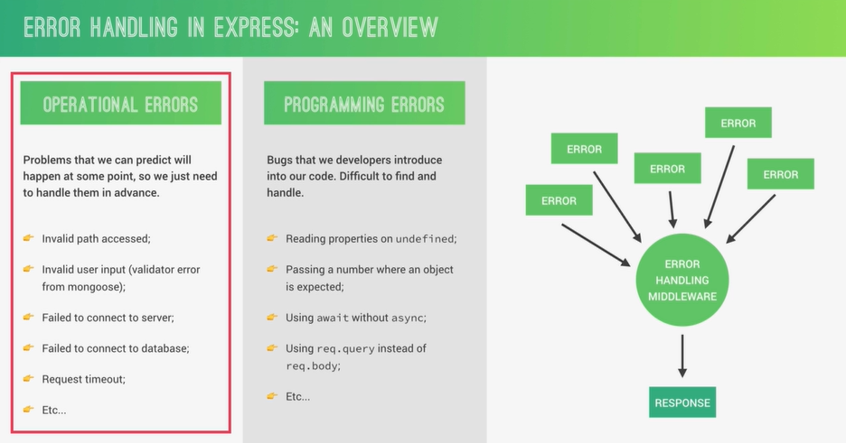

# Error Handling with Express

#### DEBUGGING NODEJS WITH NDB

```bash
# global install with npm:
npm install -g ndb

# local install with npm:
npm install --save-dev ndb

```

#### HANDLING UN-HANDLED ROUTES

```js
app.all('*', (req, res, next) => {
  res.status(404).json({
    status: 'Failed',
    message: `Can't find ${req.originalUrl} on this server`,
  });
});
```

#### AN OVERVIEW OF ERROR HANDLING



#### IMPLEMENTING A GLOBAL ERROR HANDLING MIDDLEWARE

```js
app.all('*', (req, res, next) => {
  // res.status(404).json({
  //   status: "Failed",
  //   message: `Can't find ${req.originalUrl} on this server`
  // })

  const err = new Error(`Can't find ${req.originalUrl} on this server`);
  err.status = fail;
  err.statusCode = '404';

  next(err);
});

app.use((err, req, res, next) => {
  console.log(err);
  err.status = err.status || 'error';
  err.statusCode = err.statusCode || 500;

  res.status(err.statusCode).json({
    status: err.status,
    message: err.message,
  });
});
```

#### BETTER ERRORS AND REFACTORING

```js
app.all('*', (req, res, next) => {
  // 1.
  // res.status(404).json({
  //   status: "Failed",
  //   message: `Can't find ${req.originalUrl} on this server`
  // })

  // 2.
  // const err = new Error(`Can't find ${req.originalUrl} on this server`);
  // err.status = 'fail';
  // err.statusCode = 404;

  // 3.
  next(new AppError(`Can't find ${req.originalUrl} on this server`, 404));
});

app.use((err, req, res, next) => {
  console.log(err.stack);

  err.status = err.status || 'error';
  err.statusCode = err.statusCode || 500;

  res.status(err.statusCode).json({
    status: err.status,
    message: err.message,
  });
});
```

```js
import express from 'express';
import morgan from 'morgan';

import { fileURLToPath } from 'url';
import { dirname } from 'path';

import { AppError } from './utils/appError.js';
import { errorHandler } from './utils/errorHandler.js';

const __filename = fileURLToPath(import.meta.url);
const __dirname = dirname(__filename);

const app = express();

app.use(express.json());

if (process.env.NODE_ENV !== 'development') {
  app.use(morgan('dev'));
}

app.use(express.static(`${__dirname}/../public/`));

// middleware
// app.use((req, res, next) => {
//    console.log("hello from the middleware");
//   next();
// })
// middleware
// app.use((req, res, next) => {
//   req.requestTime = new Date().toISOString();
//   next();
// })

import tourRouter from './routes/tours.routes.js';
import usersRouter from './routes/users.routes.js';

app.use('/api/v1/tours', tourRouter);
app.use('/api/v1/users', usersRouter);

app.all('*', (req, res, next) => {
  // 1.
  // res.status(404).json({
  //   status: "Failed",
  //   message: `Can't find ${req.originalUrl} on this server`
  // })

  // 2.
  // const err = new Error(`Can't find ${req.originalUrl} on this server`);
  // err.status = 'fail';
  // err.statusCode = 404;

  // 3.
  next(new AppError(`Can't find ${req.originalUrl} on this server`, 404));
});

app.use(errorHandler);

export { app };
```

```js
// ./utils/errorHandler.js

export const errorHandler = (err, req, res, next) => {
  // console.log(err.stack);

  err.status = err.status || 'error';
  err.statusCode = err.statusCode || 500;

  res.status(err.statusCode).json({
    status: err.status,
    message: err.message,
  });
};
```

#### CATCHING ERRORS IN ASYNC FUNCTIONS

```js
// ! Error Handlers for Try and catch

const catchAsync = (fn) => {
  return (req, res, next) => {
    fn(req, res, next).catch(next);
  };
};

const createTour = catchAsync(async (req, res) => {
  const newTour = await Tour.create(req.body);

  res.status(201).json({ status: 'success', data: { tour: newTour } });
});
```

```js
// ! Error Handlers for Try and catch
export const catchAsync = (fn) => {
  return (req, res, next) => {
    fn(req, res, next).catch(next);
  };
};
```

```js
import fs from 'fs';
import { fileURLToPath } from 'url';
import { dirname } from 'path';
import { Tour } from '../model/tour.model.js';
import { APIFeatures } from './APIFeatures.js';
import { catchAsync } from '../utils/catchAsync.js';

const __filename = fileURLToPath(import.meta.url);
const __dirname = dirname(__filename);

export const tours = JSON.parse(
  fs.readFileSync(`${__dirname}/../../dev-data/data/tours-simple.json`)
);

// ! middleware
const aliasTopTours = async (req, res, next) => {
  req.query.limit = '5';
  req.query.sort = '-ratingsAverage,price';
  req.query.fields = 'name,price,ratingsAverage,summary,difficulty';

  next();
};

//! TOURs

const getALLTours = catchAsync(async (req, res) => {
  const features = new APIFeatures(Tour.find(), req.query)
    .filter()
    .sort()
    .limitFields()
    .paginate();

  const tours = await features.query;

  res
    .status(200)
    .json({ status: 'success', results: tours.length, data: { tours } });
});

const getTourById = catchAsync(async (req, res) => {
  const id = req.params.id;
  const tours = await Tour.findById(id);
  // const tours = await Tour.findOne({ _id: id });

  res.status(200).json({
    status: 'success',
    data: { tours },
  });
});

const createTour = catchAsync(async (req, res) => {
  const newTour = await Tour.create(req.body);

  res.status(201).json({ status: 'success', data: { tour: newTour } });
});

const updateTour = catchAsync(async (req, res) => {
  const id = req.params.id;
  const tours = await Tour.findByIdAndUpdate(id, req.body, {
    new: true,
    runValidators: true,
  });

  res.status(200).json({ status: 'success', data: { tours } });
});

const deleteTour = catchAsync(async (req, res) => {
  const id = req.params.id;
  const tours = await Tour.findByIdAndDelete(id);

  res.status(200).json({
    status: 'success',
    data: { tours },
  });
});

// AGGREGATION PIPELINE: MATCHING AND GROUPING

const getTourStats = catchAsync(async (req, res) => {
  const stats = await Tour.aggregate([
    {
      $match: { ratingsAverage: { $gte: 4.5 } },
    },
    {
      $group: {
        _id: { $toUpper: '$difficulty' },
        // _id: '$ratingsAverage',
        numTours: { $sum: 1 },
        numRating: { $avg: '$ratingsQuantity' },
        avgRating: { $avg: '$ratingsAverage' },
        avgPrice: { $avg: '$price' },
        minPrice: { $min: '$price' },
        maxPrice: { $min: '$price' },
      },
    },
    {
      $sort: { avgPrice: 1 },
    },
    // {
    //   $match: { _id: { $ne: 'EASY' } }
    // }
  ]);

  res.status(200).json({ status: 'success', data: { stats } });
});

const getMonthlyPlan = catchAsync(async (req, res) => {
  const year = req.params.year * 1; //  __ * 1 -> thick convert into number

  const plan = await Tour.aggregate([
    { $unwind: '$startDates' },
    {
      $match: {
        startDates: {
          $gte: new Date(`${year}-01-01`),
          $lte: new Date(`${year}-12-31`),
        },
      },
    },
    {
      $group: {
        _id: { $month: '$startDates' },
        numTourStarts: { $sum: 1 },
        tours: { $push: '$name' },
      },
    },
    { $addFields: { month: '$_id' } },
    { $project: { _id: 0 } },
    { $sort: { numTourStarts: -1 } },
    { $limit: 12 },
  ]);

  res.status(200).json({
    status: 'success',
    data: { plan },
  });
});

export {
  getALLTours,
  getTourById,
  createTour,
  updateTour,
  deleteTour,
  aliasTopTours,
  getTourStats,
  getMonthlyPlan,
};

//  ----------------------------------------------------------------

// const getALLTours = async (req, res) => {
//   try {

//     const features = new APIFeatures(Tour.find(), req.query)
//       .filter().sort().limitFields().paginate()

//     const tours = await features.query;

//     res.status(200).json({
//       status: 'success',
//       results: tours.length,
//       data: { tours },
//     });
//   } catch (error) {
//     res.status(404).json({
//       status: 'error',
//       message: error
//     });
//   }
// }

// const getTourById = async (req, res) => {
//   const id = req.params.id;
//   try {
//     const tours = await Tour.findById(id);
//     // const tours = await Tour.findOne({ _id: id });

//     res.status(200).json({
//       status: 'success',
//       data: { tours },
//     });
//   } catch (error) {
//     res.status(404).json({
//       status: 'error',
//       message: error.message
//     });
//   }
// }

// const createTour = async (req, res) => {
//   try {
//     const newTour = await Tour.create(req.body);
//     res
//       .status(201)
//       .json({
//         status: 'success',
//         data: { tour: newTour }
//       });
//   } catch (error) {
//     res
//       .status(404)
//       .json({
//         status: 'fail',
//         message: error.message
//       });
//   }
// }

// const updateTour = async (req, res) => {
//   const id = req.params.id;
//   try {
//     const tours = await Tour.findByIdAndUpdate(
//       id,
//       req.body,
//       { new: true, runValidators: true },
//     );

//     res.status(200).json({
//       status: 'success',
//       data: { tours },
//     });
//   } catch (error) {
//     res.status(404).json({
//       status: 'error',
//       message: error.message
//     });
//   }
// }

// const deleteTour = async (req, res) => {
//   const id = req.params.id;
//   try {
//     const tours = await Tour.findByIdAndDelete(id);

//     res.status(200).json({
//       status: 'success',
//       data: { tours },
//     });
//   } catch (error) {
//     res.status(404).json({ status: 'error', message: error.message });
//   }
// }

// const getTourStats = async (req, res) => {
//   try {

//     const stats = await Tour.aggregate([
//       {
//         $match: { ratingsAverage: { $gte: 4.5 } }
//       },
//       {
//         $group: {
//           _id: { $toUpper: '$difficulty' },
//           // _id: '$ratingsAverage',
//           numTours: { $sum: 1 },
//           numRating: { $avg: "$ratingsQuantity" },
//           avgRating: { $avg: "$ratingsAverage" },
//           avgPrice: { $avg: "$price" },
//           minPrice: { $min: "$price" },
//           maxPrice: { $min: "$price" },
//         }
//       },
//       {
//         $sort: { avgPrice: 1 }
//       },
//       // {
//       //   $match: { _id: { $ne: 'EASY' } }
//       // }
//     ])

//     res.status(200).json({ status: 'success', data: { stats }, });

//   } catch (error) {
//     res.status(404).json({ status: 'error', message: error.message });
//   }
// }

// const getMonthlyPlan = async (req, res) => {
//   try {
//     const year = req.params.year * 1;     //  __ * 1 -> thick convert into number

//     const plan = await Tour.aggregate([
//       { $unwind: '$startDates' },
//       {
//         $match: {
//           startDates: {
//             $gte: new Date(`${year}-01-01`),
//             $lte: new Date(`${year}-12-31`),
//           }
//         }
//       },
//       {
//         $group: {
//           _id: { $month: '$startDates' },
//           numTourStarts: { $sum: 1 },
//           tours: { $push: '$name' }
//         }
//       },
//       { $addFields: { month: '$_id' } },
//       { $project: { _id: 0 } },
//       { $sort: { numTourStarts: -1 } },
//       { $limit: 12 }
//     ]);

//     res.status(200).json({
//       status: 'success',
//       data: { plan },
//     });
//   } catch (error) {
//     res.status(404).json({ status: 'error', message: error.message });
//   }
// }
```

#### ADDING 404 NOT FOUND ERRORS

```js
const getTourById = catchAsync(async (req, res, next) => {
  const id = req.params.id;
  const tours = await Tour.findById(id);

  if (!tours) {
    return next(new AppError('No tour found with that ID', 404));
  }

  // const tours = await Tour.findOne({ _id: id });

  res.status(200).json({
    status: 'success',
    data: { tours },
  });
});
```

#### ERRORS DURING DEVELOPMENT VS PRODUCTION

```js
// errorHandler.js

const sendErrorDEV = (err, res) => {
  res.status(err.statusCode).json({
    status: err.status,
    message: err.message,
    stack: err.stack,
    error: err,
  });
};

const sendErrorProd = (err, res) => {
  // Operational , trusted error : send message to client

  if (err.isOperational) {
    res
      .status(err.statusCode)
      .json({ status: err.status, message: err.message });
  } else {
    // Programming or other unknown error : don't leak error details

    // 1) Log error

    console.log(`Error 🔥🔥🔥: ${err}`);

    // 2) Send general error message

    res
      .status(500)
      .json({ status: 'error', message: 'Something went very wrong!' });
  }
};

export const errorHandler = (err, req, res, next) => {
  // console.log(err.stack);

  err.status = err.status || 'error';
  err.statusCode = err.statusCode || 500;

  if (process.env.NODE_ENV === 'development') {
    sendErrorDEV(err, res);
  } else if (process.env.NODE_ENV === 'production') {
    sendErrorProd(err, res);
  }
};
```

#### HANDLING INVALID DATABASE IDS

```js
import { AppError } from './appError';

const handleCastErrorDB = (err) => {
  const message = `Invalid ${err.path} : ${err.value}`;
  return new AppError(message, 400);
};

const sendErrorDEV = (err, res) => {
  res.status(err.statusCode).json({
    status: err.status,
    message: err.message,
    stack: err.stack,
    error: err,
  });
};

const sendErrorProd = (err, res) => {
  // Operational , trusted error : send message to client

  if (err.isOperational) {
    res
      .status(err.statusCode)
      .json({ status: err.status, message: err.message });
  } else {
    // Programming or other unknown error : don't leak error details

    // 1) Log error

    console.log(`Error 🔥🔥🔥: ${err}`);

    // 2) Send general error message

    res
      .status(500)
      .json({ status: 'error', message: 'Something went very wrong!' });
  }
};

export const errorHandler = (err, req, res, next) => {
  // console.log(err.stack);

  err.status = err.status || 'error';
  err.statusCode = err.statusCode || 500;

  if (process.env.NODE_ENV === 'development') {
    sendErrorDEV(err, res);
  } else if (process.env.NODE_ENV === 'production') {
    let error = { ...err };

    if (error.name === 'CastError') error = handleCastErrorDB(error);

    sendErrorProd(err, res);
  }
};
```

#### HANDLING DUPLICATE DATABASE FIELDS

```js
import { AppError } from './appError';

const handleCastErrorDB = (err) => {
  const message = `Invalid ${err.path} : ${err.value}`;
  return new AppError(message, 400);
};

const handleDuplicateFieldDB = (err) => {
  const value = err.errmsg.match(/([""'])(\\?.)*?\1/)[0];
  // console.log(value);
  const message = `Duplicate field value :${value}, Please use another value `;

  return new AppError(message, 400);
};

const sendErrorDEV = (err, res) => {
  res.status(err.statusCode).json({
    status: err.status,
    message: err.message,
    stack: err.stack,
    error: err,
  });
};

const sendErrorProd = (err, res) => {
  // Operational , trusted error : send message to client

  if (err.isOperational) {
    res
      .status(err.statusCode)
      .json({ status: err.status, message: err.message });
  } else {
    // Programming or other unknown error : don't leak error details

    // 1) Log error

    console.log(`Error 🔥🔥🔥: ${err}`);

    // 2) Send general error message

    res
      .status(500)
      .json({ status: 'error', message: 'Something went very wrong!' });
  }
};

export const errorHandler = (err, req, res, next) => {
  // console.log(err.stack);

  err.status = err.status || 'error';
  err.statusCode = err.statusCode || 500;

  if (process.env.NODE_ENV === 'development') {
    sendErrorDEV(err, res);
  } else if (process.env.NODE_ENV === 'production') {
    let error = { ...err };

    if (error.name === 'CastError') error = handleCastErrorDB(error);
    if (error.code === '11000') error = handleDuplicateFieldDB(error);

    sendErrorProd(err, res);
  }
};
```

#### HANDLING MONGOOSE VALIDATION ERRORS

```js
import { AppError } from './appError.js';

const handleCastErrorDB = (err) => {
  const message = `Invalid ${err.path} : ${err.value}`;
  return new AppError(message, 400);
};

const handleValidationErrorDB = (err) => {
  const errors = Object.values(err.errors).map((el) => el.message);

  const message = `Invalid input data. ${errors.join('. ')}`;
  return new AppError(message, 400);
};

const handleDuplicateFieldDB = (err) => {
  const value = err.errmsg.match(/([""'])(\\?.)*?\1/)[0];
  // console.log(value);
  const message = `Duplicate field value :${value}, Please use another value `;

  return new AppError(message, 400);
};

const sendErrorDEV = (err, res) => {
  res.status(err.statusCode).json({
    status: err.status,
    message: err.message,
    stack: err.stack,
    error: err,
  });
};

const sendErrorProd = (err, res) => {
  // Operational , trusted error : send message to client

  if (err.isOperational) {
    res
      .status(err.statusCode)
      .json({ status: err.status, message: err.message });
  } else {
    // Programming or other unknown error : don't leak error details

    // 1) Log error

    console.log(`Error 🔥🔥🔥: ${err}`);

    // 2) Send general error message

    res
      .status(500)
      .json({ status: 'error', message: 'Something went very wrong!' });
  }
};

export const errorHandler = (err, req, res, next) => {
  // console.log(err.stack);

  err.status = err.status || 'error';
  err.statusCode = err.statusCode || 500;

  if (process.env.NODE_ENV === 'development') {
    sendErrorDEV(err, res);
  } else if (process.env.NODE_ENV === 'production') {
    let error = { ...err };

    if (error.name === 'CastError') error = handleCastErrorDB(error);
    if (error.code === 11000) error = handleDuplicateFieldDB(error);
    if (error.name === 'ValidationError')
      error = handleValidationErrorDB(error);

    sendErrorProd(err, res);
  }
};
```

#### ERRORS OUTSIDE EXPRESS: UNHANDLED REJECTIONS

```js
import dotenv from 'dotenv';
import mongoose from 'mongoose';
import { app } from './app.js';
import { Tour } from './model/tour.model.js';

dotenv.config();

mongoose
  // .connect(process.env.MONGODB_URL_LOCAL)
  .connect(process.env.MONGODB_URL)
  .then((con) =>
    console.log(con.connection.host + ' is Connected to Mongo DB')
  );

// const testTour = new Tour({
//   name: 'The Parks and Forest Hiker',
//   price: 497,
//   rating: 4.7,
// })

// testTour
//   .save()
//   .then(document => console.log(document))
//   .catch(error => console.log(error.message))

const PORT = process.env.PORT || 8000;

const server = app.listen(PORT, () => {
  console.log(`listening on http://127.0.0.1:${PORT}`);
});

process.on('unhandledRejection', (err) => {
  console.log(err.name, err.message);
  console.log(`Unhandled rejection 🔥🔥🔥 Shutting down..`);
  server.close(() => {
    process.exit(1);
  });
});

// console.log(app.get('env'));
// console.log(process.env);
// console.log(process.env.PORT);

// mongoose.connect(process.env.MONGODB_URL)
//   .then((con) => {
//     console.log(con.connection.port)
//     console.log(con.connection.models)
//     console.log(con.connection.host)
//     console.log(con.connection.name)
//   });
```

#### CATCHING UNCAUGHT EXCEPTIONS

```js
import dotenv from 'dotenv';
import mongoose from 'mongoose';
import { app } from './app.js';
import { Tour } from './model/tour.model.js';

dotenv.config();

process.on('uncaughtException', () => {
  console.log(`Uncaught exception 🔥🔥🔥 Shutting down..`);
  console.log(err.name, err.message);
  process.exit(1);
});

mongoose
  // .connect(process.env.MONGODB_URL_LOCAL)
  .connect(process.env.MONGODB_URL)
  .then((con) =>
    console.log(con.connection.host + ' is Connected to Mongo DB')
  );

const PORT = process.env.PORT || 8000;

const server = app.listen(PORT, () => {
  console.log(`listening on http://127.0.0.1:${PORT}`);
});

process.on('unhandledRejection', (err) => {
  console.log(`Unhandled rejection 🔥🔥🔥 Shutting down..`);
  console.log(err.name, err.message);
  server.close(() => {
    process.exit(1);
  });
});
```
