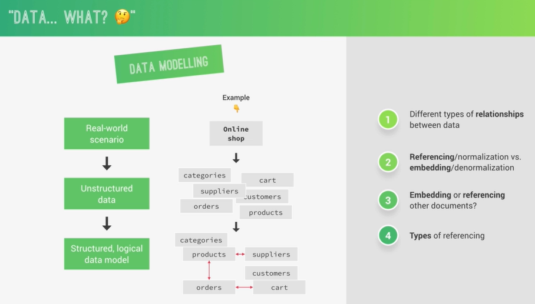
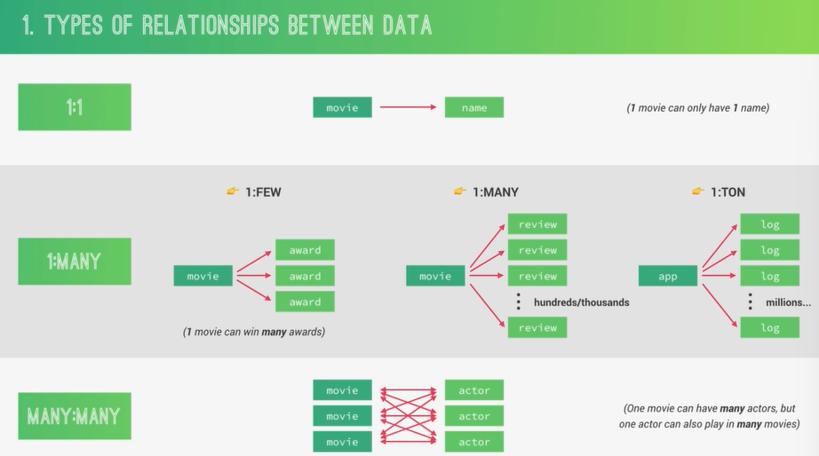
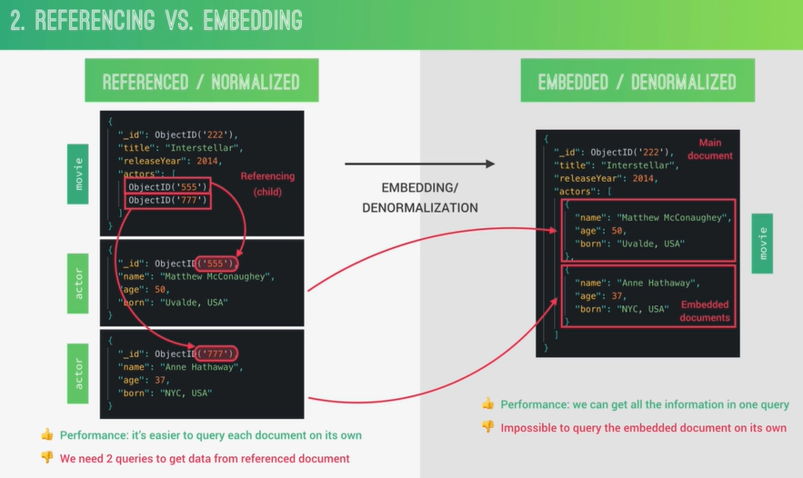
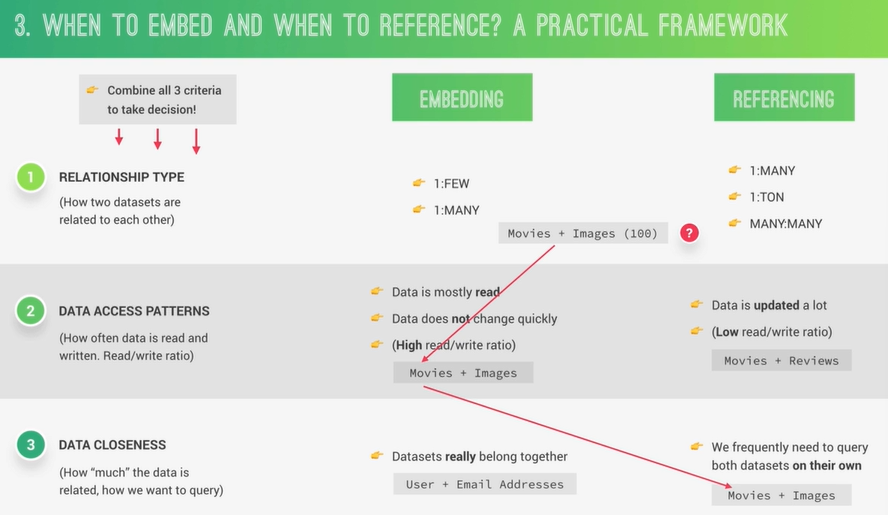
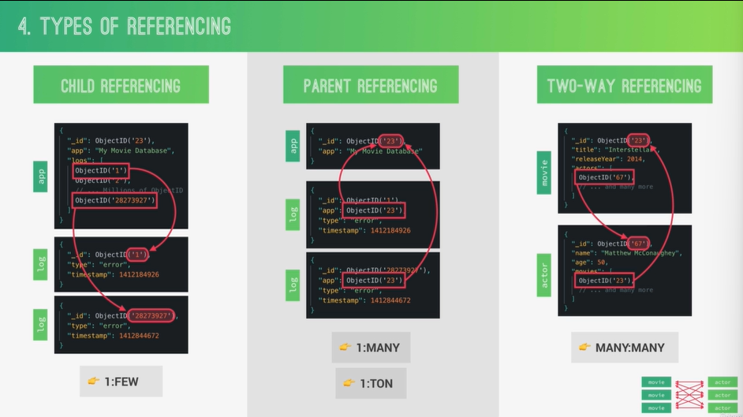
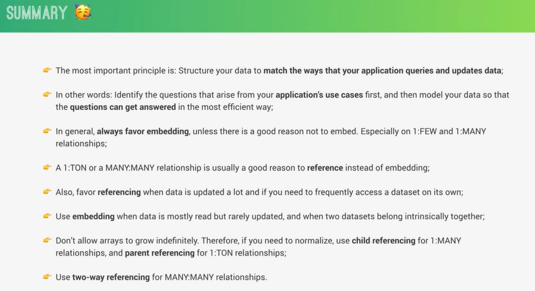
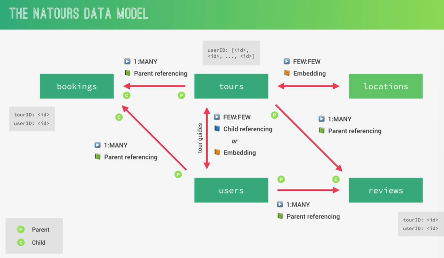

# MODELLING DATA AND ADVANCED MONGOOSE

#### 1. MONGODB DATA MODELLING








#### 2. DESIGNING OUR DATA MODEL



#### 3. MODELLING LOCATIONS (GEO-SPATIAL DATA)

```js
import mongoose from 'mongoose';
import slugify from 'slugify';
import validator from 'validator';

const tourSchema = new mongoose.Schema(
  {
    name: {
      type: String,
      required: [true, 'A tour must have a name'],
      unique: true,
      trim: true,
      maxlength: [40, 'A tour must have a less or equal then 40 characters'],
      minlength: [3, 'A tour must have a less or equal then 40 characters'],
      // validate: [validator.isAlpha, 'Tour name must be only contain alpha characters']
    },
    slug: {
      type: String,
    },
    duration: {
      type: Number,
      required: [true, 'A tour must have a duration'],
    },
    maxGroupSize: {
      type: Number,
      required: [true, 'A tour must have a group size'],
    },
    difficulty: {
      type: String,
      required: [true, 'A tour must have a difficulty'],
      enum: {
        values: ['easy', 'medium', 'difficult'],
        message: 'Difficulty is either: easy, medium, difficult',
      },
    },
    ratingsAverage: {
      type: Number,
      default: 0,
      min: [1, 'Rating must be above 1.0'],
      max: [5, 'Rating must be below 5.0'],
    },
    ratingsQuantity: {
      type: Number,
      default: 0,
    },
    price: {
      type: Number,
      required: [true, 'A tour must have a price'],
    },
    priceDiscount: {
      type: Number,
      validate: {
        validator: function (val) {
          // this only points to current doc on new document creation
          return val < this.price; // 100 < 200
        },
        message: 'Discount price ({VALUE}) should be below regular price',
      },
    },
    summary: {
      type: String,
      required: [true, 'A tour must have a summary'],
      trim: true,
    },
    description: {
      type: String,
      required: [true, 'A tour must have a description'],
    },
    imageCover: {
      type: String,
      required: [true, 'A tour must have a cover image'],
    },
    images: [{ type: String }],
    createdAt: { type: Date, default: Date.now() },
    startDates: [{ type: Date }],
    secretTour: { type: Boolean, default: false },
    startLocation: {
      // GEO-JSON
      type: { type: String, default: 'Point', enum: ['Point'] },
      coordinates: [Number],
      address: String,
      description: String,
    },
    location: {
      type: { type: String, default: 'Point', enum: ['Point'] },
      coordinates: [Number],
      address: String,
      description: String,
      day: Number,
    },
  },
  {
    toJSON: { virtuals: true },
    toObject: { virtuals: true },
  }
);

tourSchema.virtual(`durationWeeks`).get(function () {
  return this.duration / 7;
});

// AGGREGATION MIDDLEWARE
tourSchema.pre('aggregate', function (next) {
  this.pipeline().unshift({ $match: { secretTour: { $ne: true } } });
  // console.log(this.pipeline());
  next();
});

// DOCUMENT MIDDLEWARE :Runs before .save() and .create() not but for update()
// .save() is called hooks or middleware.
tourSchema.pre('save', function (next) {
  // console.log(this);
  this.slug = slugify(this.name, { lower: true });
  next();
});

// tourSchema.pre('save', function (next) {
//   console.log('Will save Document');

//   next();
// })

// tourSchema.post('save', function (doc, next) {
//   console.log(doc);
//   next();
// })

// QUERY MIDDLEWARE
tourSchema.pre(/^find/, function (next) {
  this.find({ secretTour: { $ne: true } });

  this.start = Date.now();
  next();
});

tourSchema.post(/^find/, function (docs, next) {
  console.log(`Query took ${Date.now() - this.start} milliseconds`);
  // console.log(docs);
  next();
});

export const Tour = mongoose.model('Tour', tourSchema);
```

#### 4. MODELLING TOUR GUIDES: EMBEDDING

```js
import mongoose from 'mongoose';
import slugify from 'slugify';
import validator from 'validator';

const tourSchema = new mongoose.Schema(
  {
    name: {
      type: String,
      required: [true, 'A tour must have a name'],
      unique: true,
      trim: true,
      maxlength: [40, 'A tour must have a less or equal then 40 characters'],
      minlength: [3, 'A tour must have a less or equal then 40 characters'],
      // validate: [validator.isAlpha, 'Tour name must be only contain alpha characters']
    },
    slug: {
      type: String,
    },
    duration: {
      type: Number,
      required: [true, 'A tour must have a duration'],
    },
    maxGroupSize: {
      type: Number,
      required: [true, 'A tour must have a group size'],
    },
    difficulty: {
      type: String,
      required: [true, 'A tour must have a difficulty'],
      enum: {
        values: ['easy', 'medium', 'difficult'],
        message: 'Difficulty is either: easy, medium, difficult',
      },
    },
    ratingsAverage: {
      type: Number,
      default: 0,
      min: [1, 'Rating must be above 1.0'],
      max: [5, 'Rating must be below 5.0'],
    },
    ratingsQuantity: {
      type: Number,
      default: 0,
    },
    price: {
      type: Number,
      required: [true, 'A tour must have a price'],
    },
    priceDiscount: {
      type: Number,
      validate: {
        validator: function (val) {
          // this only points to current doc on new document creation
          return val < this.price; // 100 < 200
        },
        message: 'Discount price ({VALUE}) should be below regular price',
      },
    },
    summary: {
      type: String,
      required: [true, 'A tour must have a summary'],
      trim: true,
    },
    description: {
      type: String,
      required: [true, 'A tour must have a description'],
    },
    imageCover: {
      type: String,
      required: [true, 'A tour must have a cover image'],
    },
    images: [{ type: String }],
    createdAt: { type: Date, default: Date.now() },
    startDates: [{ type: Date }],
    secretTour: { type: Boolean, default: false },
    startLocation: {
      // GEO-JSON
      type: { type: String, default: 'Point', enum: ['Point'] },
      coordinates: [Number],
      address: String,
      description: String,
    },
    location: {
      type: { type: String, default: 'Point', enum: ['Point'] },
      coordinates: [Number],
      address: String,
      description: String,
      day: Number,
    },
    guides: Array,
  },
  {
    toJSON: { virtuals: true },
    toObject: { virtuals: true },
  }
);

tourSchema.pre('save', async function (next) {
  const guidesPromises = this.guides.map(async (id) => await User.findById(id));
  this.guides = await Promise.all(guidesPromises);
  next();
});
```

#### 5. MODELLING TOUR GUIDES: CHILD REFERENCING

```js
import mongoose from 'mongoose';
import slugify from 'slugify';
import validator from 'validator';

const tourSchema = new mongoose.Schema(
  {
    name: {
      type: String,
      required: [true, 'A tour must have a name'],
      unique: true,
      trim: true,
      maxlength: [40, 'A tour must have a less or equal then 40 characters'],
      minlength: [3, 'A tour must have a less or equal then 40 characters'],
      // validate: [validator.isAlpha, 'Tour name must be only contain alpha characters']
    },
    slug: {
      type: String,
    },
    duration: {
      type: Number,
      required: [true, 'A tour must have a duration'],
    },
    maxGroupSize: {
      type: Number,
      required: [true, 'A tour must have a group size'],
    },
    difficulty: {
      type: String,
      required: [true, 'A tour must have a difficulty'],
      enum: {
        values: ['easy', 'medium', 'difficult'],
        message: 'Difficulty is either: easy, medium, difficult',
      },
    },
    ratingsAverage: {
      type: Number,
      default: 0,
      min: [1, 'Rating must be above 1.0'],
      max: [5, 'Rating must be below 5.0'],
    },
    ratingsQuantity: {
      type: Number,
      default: 0,
    },
    price: {
      type: Number,
      required: [true, 'A tour must have a price'],
    },
    priceDiscount: {
      type: Number,
      validate: {
        validator: function (val) {
          // this only points to current doc on new document creation
          return val < this.price; // 100 < 200
        },
        message: 'Discount price ({VALUE}) should be below regular price',
      },
    },
    summary: {
      type: String,
      required: [true, 'A tour must have a summary'],
      trim: true,
    },
    description: {
      type: String,
      required: [true, 'A tour must have a description'],
    },
    imageCover: {
      type: String,
      required: [true, 'A tour must have a cover image'],
    },
    images: [{ type: String }],
    createdAt: { type: Date, default: Date.now() },
    startDates: [{ type: Date }],
    secretTour: { type: Boolean, default: false },
    startLocation: {
      // GEO-JSON
      type: { type: String, default: 'Point', enum: ['Point'] },
      coordinates: [Number],
      address: String,
      description: String,
    },
    location: {
      type: { type: String, default: 'Point', enum: ['Point'] },
      coordinates: [Number],
      address: String,
      description: String,
      day: Number,
    },
    guides: [{ type: mongoose.Schema.ObjectId, ref: 'User' }],
  },
  {
    toJSON: { virtuals: true },
    toObject: { virtuals: true },
  }
);
```

#### 6. POPULATING TOUR GUIDES

```js
import mongoose from 'mongoose';
import slugify from 'slugify';
import validator from 'validator';

const tourSchema = new mongoose.Schema(
  {
    name: {
      type: String,
      required: [true, 'A tour must have a name'],
      unique: true,
      trim: true,
      maxlength: [40, 'A tour must have a less or equal then 40 characters'],
      minlength: [3, 'A tour must have a less or equal then 40 characters'],
      // validate: [validator.isAlpha, 'Tour name must be only contain alpha characters']
    },
    slug: {
      type: String,
    },
    duration: {
      type: Number,
      required: [true, 'A tour must have a duration'],
    },
    maxGroupSize: {
      type: Number,
      required: [true, 'A tour must have a group size'],
    },
    difficulty: {
      type: String,
      required: [true, 'A tour must have a difficulty'],
      enum: {
        values: ['easy', 'medium', 'difficult'],
        message: 'Difficulty is either: easy, medium, difficult',
      },
    },
    ratingsAverage: {
      type: Number,
      default: 0,
      min: [1, 'Rating must be above 1.0'],
      max: [5, 'Rating must be below 5.0'],
    },
    ratingsQuantity: {
      type: Number,
      default: 0,
    },
    price: {
      type: Number,
      required: [true, 'A tour must have a price'],
    },
    priceDiscount: {
      type: Number,
      validate: {
        validator: function (val) {
          // this only points to current doc on new document creation
          return val < this.price; // 100 < 200
        },
        message: 'Discount price ({VALUE}) should be below regular price',
      },
    },
    summary: {
      type: String,
      required: [true, 'A tour must have a summary'],
      trim: true,
    },
    description: {
      type: String,
      required: [true, 'A tour must have a description'],
    },
    imageCover: {
      type: String,
      required: [true, 'A tour must have a cover image'],
    },
    images: [{ type: String }],
    createdAt: { type: Date, default: Date.now() },
    startDates: [{ type: Date }],
    secretTour: { type: Boolean, default: false },
    startLocation: {
      // GEO-JSON
      type: { type: String, default: 'Point', enum: ['Point'] },
      coordinates: [Number],
      address: String,
      description: String,
    },
    location: {
      type: { type: String, default: 'Point', enum: ['Point'] },
      coordinates: [Number],
      address: String,
      description: String,
      day: Number,
    },
    guides: [{ type: mongoose.Schema.ObjectId, ref: 'User' }],
  },
  {
    toJSON: { virtuals: true },
    toObject: { virtuals: true },
  }
);

tourSchema.pre(/^find/, function (next) {
  this.populate({
    path: 'guides',
    select: '-__v -passwordChangedAt -createdAt -updatedAt',
  });

  next();
});
```

#### 7. MODELLING REVIEWS: PARENT REFERENCING

```js
import mongoose from 'mongoose';

const reviewSchema = new mongoose.Schema(
  {
    review: {
      type: String,
      required: [true, 'Review can not be empty!'],
    },
    rating: {
      type: Number,
      min: 1,
      max: 5,
    },
    tour: {
      type: mongoose.Schema.ObjectId,
      ref: 'Tour',
      required: [true, 'Review must belong to a tour.'],
    },
    user: {
      type: mongoose.Schema.ObjectId,
      ref: 'User',
      required: [true, 'Review must belong to a user.'],
    },
    createdAt: {
      type: Date,
      default: Date.now,
    },
  },
  {
    toJSON: { virtuals: true },
    toObject: { virtuals: true },
  }
);

export const Review = mongoose.model('Review', reviewSchema);
```

#### 8. CREATING AND GETTING REVIEWS

```js
app.use('/api/v1/reviews', reviewRouter);
```

```js
import mongoose from 'mongoose';

const reviewSchema = new mongoose.Schema(
  {
    review: {
      type: String,
      required: [true, 'Review can not be empty!'],
    },
    rating: {
      type: Number,
      min: 1,
      max: 5,
    },
    tour: {
      type: mongoose.Schema.ObjectId,
      ref: 'Tour',
      required: [true, 'Review must belong to a tour.'],
    },
    user: {
      type: mongoose.Schema.ObjectId,
      ref: 'User',
      required: [true, 'Review must belong to a user.'],
    },
    createdAt: {
      type: Date,
      default: Date.now,
    },
  },
  {
    toJSON: { virtuals: true },
    toObject: { virtuals: true },
  }
);

reviewSchema.pre(/^find/, function (next) {
  this.populate({ path: 'tour', select: 'name' }).populate({
    path: 'user',
    select: 'name photo',
  });

  next();
});

export const Review = mongoose.model('Review', reviewSchema);
```

```js
import { Review } from '../model/review.model.js';
import { AppError } from '../utils/appError.js';
import { catchAsync } from '../utils/catchAsync.js';

import express from 'express';

import {
  createReview,
  getALLReviews,
  // getReviewById
} from '../controllers/review.controller.js';

import {
  protectMiddleware,
  restrictToMiddleware,
} from '../controllers/auth.controller.js';

const router = express.Router();

router
  .route('/')
  .get(getALLReviews)
  .post(protectMiddleware, restrictToMiddleware('user'), createReview);

export default router;
```

```js
const getALLReviews = catchAsync(async (req, res) => {
  const review = await Review.find({});
  res
    .status(200)
    .json({ status: 'success', results: review.length, data: { review } });
});

const getReviewById = catchAsync(async (req, res, next) => {
  const review = await Review.findById(req.params.id);

  if (!review) {
    return next(new AppError('No review found with that ID', 404));
  }

  // const review = await Review.findOne({ _id: id });

  res.status(200).json({
    status: 'success',
    data: { review },
  });
});

const createReview = catchAsync(async (req, res) => {
  const newReview = await Review.create(req.body);

  res.status(201).json({ status: 'success', data: { review: newReview } });
});

export { getALLReviews, getReviewById, createReview };
```

#### 9. POPULATING REVIEWS

```js
import mongoose from 'mongoose';

const reviewSchema = new mongoose.Schema(
  {
    review: {
      type: String,
      required: [true, 'Review can not be empty!'],
    },
    rating: {
      type: Number,
      min: 1,
      max: 5,
    },
    tour: {
      type: mongoose.Schema.ObjectId,
      ref: 'Tour',
      required: [true, 'Review must belong to a tour.'],
    },
    user: {
      type: mongoose.Schema.ObjectId,
      ref: 'User',
      required: [true, 'Review must belong to a user.'],
    },
    createdAt: {
      type: Date,
      default: Date.now,
    },
  },
  {
    toJSON: { virtuals: true },
    toObject: { virtuals: true },
  }
);

reviewSchema.pre(/^find/, function (next) {
  this
    // .populate({ path: 'tour', select: "name" })
    .populate({ path: 'user', select: 'name photo' });

  next();
});

export const Review = mongoose.model('Review', reviewSchema);
```

#### 10. VIRTUAL POPULATE: TOURS AND REVIEWS

```js
// virtual populate
tourSchema.virtual('reviews', {
  ref: 'Review',
  foreignField: 'tour',
  localField: '_id',
});

const getTourById = catchAsync(async (req, res, next) => {
  const tours = await Tour.findById(req.params.id).populate('reviews');

  if (!tours) {
    return next(new AppError('No tour found with that ID', 404));
  }

  // const tours = await Tour.findOne({ _id: id });

  res.status(200).json({
    status: 'success',
    data: { tours },
  });
});
```

#### 11. IMPLEMENTING SIMPLE NESTED ROUTES

```js
// POST /tour/:tourId/reviews
// GET /tour/:tourId/reviews
// GET /tour/:tourId/reviews/reviewID

router
  .route('/:tourId/reviews')
  .post(protectMiddleware, restrictToMiddleware('user'), createReview);

const createReview = catchAsync(async (req, res) => {
  // Allow nested routes
  if (!req.body.tour) req.body.tour = req.params.tourId;
  if (!req.body.user) req.body.user = req.user.id;

  const newReview = await Review.create(req.body);

  res.status(201).json({ status: 'success', data: { review: newReview } });
});
```

```js
// POST {{NATOURS_URL}}/api/v1/tours/:tourId/reviews

// {
//     "rating":5,
//     "review":"best tour in the worlds!!!"
// }

// {
//     "status": "success",
//     "data": {
//         "review": {
//             "review": "best tour in the worlds!!!",
//             "rating": 5,
//             "tour": "5c88fa8cf4afda39709c2951",
//             "user": "663656e9491daaedacd7dd5f",
//             "_id": "663658643531913e627d78bb",
//             "createdAt": "2024-05-04T15:46:44.277Z",
//             "__v": 0,
//             "id": "663658643531913e627d78bb"
//         }
//     }
// }
```

#### 12. NESTED ROUTES WITH EXPRESS

```js
import express from 'express';

import {
  protectMiddleware,
  restrictToMiddleware,
} from '../controllers/auth.controller.js';

import reviewRouter from '../routes/reviews.routes.js';

const router = express.Router();

router.use('/:tourId/reviews', reviewRouter);


// POST /tour/:tourId/reviews
// GET /tour/:tourId/reviews
// GET /tour/:tourId/reviews/reviewID

// router
//   .route('/:tourId/reviews')
//   .post(
//     protectMiddleware,
//     restrictToMiddleware('user'),
//     createReview,
//   )

export default router;


import express from 'express';


import {
  createReview,
  getALLReviews,
} from '../controllers/review.controller.js';

import {
  protectMiddleware,
  restrictToMiddleware
} from '../controllers/auth.controller.js';

const router = express.Router({ mergeParams: true });


// POST /:tourId/reviews
// POST /reviews

router
  .route("/")
  .get(getALLReviews)
  .post(
    protectMiddleware,
    restrictToMiddleware('user'),
    createReview
  )


export default router;
```

#### 13. ADDING A NESTED GET ENDPOINT

```js
const getALLReviews = catchAsync(async (req, res) => {
  let filter = {};

  if (req.params.tourId) filter = { tour: req.params.tourId };

  const reviews = await Review.find(filter);

  res
    .status(200)
    .json({ status: 'success', results: reviews.length, data: { reviews } });
});
```

#### 14. BUILDING HANDLER FACTORY FUNCTIONS: DELETE

```js
// handleFactory.js
import { AppError } from '../utils/appError.js';
import { catchAsync } from '../utils/catchAsync.js';

const handleFactory = {
  deleteOne: (Model) =>
    catchAsync(async (req, res, next) => {
      const doc = await Model.findByIdAndDelete(req.params.id);

      if (!doc) {
        return next(new AppError('No Document found with that ID', 404));
      }

      res.status(200).json({ status: 'success', data: null });
    }),
};

export default handleFactory;
```

```js
import handleFactory from './handleFactory.js';

// const deleteTour = catchAsync(async (req, res, next) => {
//   const id = req.params.id;
//   const tours = await Tour.findByIdAndDelete(id);

//   if (!tours) {
//     return next(new AppError('No tour found with that ID', 404));
//   }

//   res.status(200).json({
//     status: 'success',
//     data: { tours },
//   });
// })

const deleteTour = handleFactory.deleteOne(Tour);
```

```js
import handleFactory from './handleFactory.js';

const deleteReview = handleFactory.deleteOne(Review);

export { deleteReview };
```

```js
import handleFactory from './handleFactory.js';

// const deleteUser = catchAsync(async (req, res, next) => {
//   res.status(500).json({
//     status: "error",
//     message: "This routes is nto yet defined"
//   })
// });

const deleteUser = handleFactory.deleteOne(User);
```

#### 15. FACTORY FUNCTIONS: UPDATE AND CREATE

```js
import { AppError } from '../utils/appError.js';
import { catchAsync } from '../utils/catchAsync.js';

const handleFactory = {
  deleteOne: (Model) =>
    catchAsync(async (req, res, next) => {
      const id = req.params.id;
      const doc = await Model.findByIdAndDelete(id);

      if (!doc) {
        return next(new AppError('No Document found with that ID', 404));
      }

      res.status(200).json({ status: 'success', data: null });
    }),

  updateOne: (Model, ModelName) =>
    catchAsync(async (req, res, next) => {
      const id = req.params.id;

      const doc = await Model.findByIdAndUpdate(id, req.body, {
        new: true,
        runValidators: true,
      });

      if (!doc) {
        return next(new AppError('No Document found with that ID', 404));
      }

      const responseData = {};
      responseData[ModelName] = doc;

      res.status(200).json({ status: 'success', data: responseData });
    }),

  createOne: (Model, ModelName) =>
    catchAsync(async (req, res) => {
      const doc = await Model.create(req.body);

      // if (!doc) {
      //   return next(new AppError('No Document found with that ID', 404));
      // }

      const responseData = {};
      responseData[ModelName] = doc;

      res.status(201).json({ status: 'success', data: responseData });
    }),
};

export default handleFactory;
```

```js
router
  .route('/')
  .post(
    protectMiddleware,
    restrictToMiddleware('user'),
    setTourUserIdsMiddleware,
    createReview
  );

router.route('/:id').patch(updateReview);

import { Review } from '../model/review.model.js';
import { AppError } from '../utils/appError.js';
import { catchAsync } from '../utils/catchAsync.js';

import handleFactory from './handleFactory.js';

const setTourUserIdsMiddleware = (req, res, next) => {
  if (!req.body.tour) req.body.tour = req.params.tourId;
  if (!req.body.user) req.body.user = req.user.id;

  console.log(req.body.tour, req.body.user);
  next();
};

const createReview = handleFactory.createOne(Review, 'review');
const updateReview = handleFactory.updateOne(Review, 'review');

export { createReview, updateReview };
```

```js
import { User } from '../model/user.model.js';
import { AppError } from '../utils/appError.js';
import { catchAsync } from '../utils/catchAsync.js';

import handleFactory from './handleFactory.js';

// Do NOT update passwords with this api
const updateUser = handleFactory.updateOne(User, 'user');

// const updateUser = catchAsync(async (req, res, next) => {
//   res.status(500).json({
//     status: "error",
//     message: "This routes is nto yet defined"
//   })
// });

export { updateUser };
```

```js
import { Tour } from '../model/tour.model.js';
import { catchAsync } from '../utils/catchAsync.js';

import { AppError } from '../utils/appError.js';

import handleFactory from './handleFactory.js';

// ! create Tour
// const createTour = catchAsync(async (req, res) => {
//   const newTour = await Tour.create(req.body);

//   res.status(201)
//     .json({ status: 'success', data: { tour: newTour } });
// })

const createTour = handleFactory.createOne(Tour, 'tours');

// ! update tour
// const updateTour = catchAsync(async (req, res, next) => {
//   const id = req.params.id;
//   const tours = await Tour.findByIdAndUpdate(
//     id, req.body, { new: true, runValidators: true },
//   );

//   if (!tours) {
//     return next(new AppError('No tour found with that ID', 404));
//   }

//   res.status(200).json({ status: 'success', data: { tours }, });
// })

const updateTour = handleFactory.updateOne(Tour, 'tours');

export { createTour, updateTour };
```

#### 16. FACTORY FUNCTIONS: READING

```js
import { AppError } from '../utils/appError.js';
import { catchAsync } from '../utils/catchAsync.js';
import { APIFeatures } from './APIFeatures.js';

const handleFactory = {
  getOne: (Model, ModelName, popOptions) =>
    catchAsync(async (req, res, next) => {
      let query = await Model.findById(req.params.id);

      if (popOptions) query = query.populate(popOptions);

      const doc = await query;

      if (!doc) {
        return next(new AppError('No Document found with that ID', 404));
      }

      // const tours = await Tour.findOne({ _id: id });

      const responseData = {};
      responseData[ModelName] = doc;

      res.status(201).json({ status: 'success', data: responseData });
    }),

  getAll: (Model, ModelName) =>
    catchAsync(async (req, res) => {
      //to allow for nested GET reviews on tour (little hack)
      let filter = {};
      if (req.params.tourId) filter = { tour: req.params.tourId };

      const features = new APIFeatures(Model.find(filter), req.query)
        .filter()
        .sort()
        .limitFields()
        .paginate();

      const doc = await features.query;

      res.status(200).json({
        status: 'success',
        results: doc.length,
        data: { [ModelName]: doc },
      });
    }),
};

export default handleFactory;
```

```js
import { Tour } from '../model/tour.model.js';
import { catchAsync } from '../utils/catchAsync.js';

import { AppError } from '../utils/appError.js';

import handleFactory from './handleFactory.js';

// const getALLTours = catchAsync(async (req, res) => {
//   const features = new APIFeatures(Tour.find(), req.query)
//     .filter().sort().limitFields().paginate()

//   const tours = await features.query;

//   res.status(200)
//     .json({ status: 'success', results: tours.length, data: { tours }, });
// })

const getALLTours = handleFactory.getAll(Tour, 'tours');

// ! get Tour By Id
// const getTourById = catchAsync(async (req, res, next) => {

//   const tours = await Tour.findById(req.params.id).populate('reviews')

//   if (!tours) {
//     return next(new AppError('No tour found with that ID', 404))
//   }

//   // const tours = await Tour.findOne({ _id: id });

//   res.status(200).json({
//     status: 'success',
//     data: { tours },
//   });
// })

const getTourById = handleFactory.getOne(Tour, 'tours', { path: 'reviews' });

export { getTourById, getALLTours };
```

```js
import { User } from '../model/user.model.js';
import { AppError } from '../utils/appError.js';
import { catchAsync } from '../utils/catchAsync.js';

import handleFactory from './handleFactory.js';

// const getAllUsers = catchAsync(async (req, res, next) => {

//   const users = await User.find({});

//   res.status(200)
//     .json({
//       status: 'success', results: users.length, data: { users },
//     });
// })

const getAllUsers = handleFactory.getAll(User, 'user');

const getUserById = handleFactory.getOne(User, 'user');

export { getUserById, getAllUsers };
```

```js
router.route('/:id').get(getReviewById);

import { Review } from '../model/review.model.js';
import { AppError } from '../utils/appError.js';
import { catchAsync } from '../utils/catchAsync.js';

import handleFactory from './handleFactory.js';

// const getALLReviews = catchAsync(async (req, res) => {

//   let filter = {};

//   if (req.params.tourId) filter = { tour: req.params.tourId }

//   const reviews = await Review.find(filter)

//   res.status(200)
//     .json({ status: 'success', results: reviews.length, data: { reviews }, });
// })

const getALLReviews = handleFactory.getAll(Review, 'review');

// const getReviewById = catchAsync(async (req, res, next) => {
//   const review = await Review.findById(req.params.id)

//   if (!review) {
//     return next(new AppError('No review found with that ID', 404))
//   }
//   // const review = await Review.findOne({ _id: id });
//   res.status(200).json({
//     status: 'success',
//     data: { review },
//   });
// })

const getReviewById = handleFactory.getOne(Review, 'review');

export { getReviewById, getALLReviews };
```

```js

```

#### 17. ADDING A /ME ENDPOINT

```js
router.get('/currentMe', protectMiddleware, getMe, getUserById);
// ! ME Api
const getMe = catchAsync(async (req, res, next) => {
  req.params.id = req.user.id;
  next();
});
```

#### 18. ADDING MISSING AUTHENTICATION AND AUTHORIZATION

```js
// tour routes
router
  .route('/monthly-plan/:year')
  // .get(getMonthlyPlan);
  .get(
    protectMiddleware,
    restrictToMiddleware('admin', 'lead-guide', 'guide'),
    getMonthlyPlan
  );

router
  .route('/')
  // .get(protectMiddleware, getALLTours)
  // .post(createTour);
  .get(getALLTours)
  .post(
    protectMiddleware,
    restrictToMiddleware('admin', 'lead-guide'),
    createTour
  );

router
  .route('/:id')
  .get(getTourById)
  // .patch(updateTour)
  .patch(
    protectMiddleware,
    restrictToMiddleware('admin', 'lead-guide'),
    updateTour
  )
  .delete(
    protectMiddleware,
    restrictToMiddleware('admin', 'lead-guide'),
    deleteTour
  );
```

```js
import express from 'express';

import {
  signup,
  login,
  forgotPassword,
  resetPassword,
  updatePassword,
  protectMiddleware,
} from '../controllers/auth.controller.js';

import {
  getAllUsers,
  getUserById,
  createUser,
  updateUser,
  deleteUser,
  getMe,
  updateMe,
  deleteMe,
} from '../controllers/users.controller.js';

const router = express.Router();

router.post('/signup', signup);
router.post('/login', login);

router.post('/forgotPassword', forgotPassword);
router.patch('/resetPassword/:token', resetPassword);

// * applies to below routes (protect middleware)
router.use(protectMiddleware);
// *

router.patch('/updateMyPassword/:token', updatePassword);

router.get('/currentMe', getMe, getUserById);
router.patch('/updateMe', updateMe);
router.delete('/deleteMe', deleteMe);

// * applies to below routes (restrict To Middleware)
router.use(restrictToMiddleware('admin'));
// *

router.route('/').get(getAllUsers).post(createUser);

router.route('/:id').get(getUserById).patch(updateUser).delete(deleteUser);

export default router;
```

```js
import express from 'express';

import {
  createReview,
  getALLReviews,
  getReviewById,
  setTourUserIdsMiddleware,
  updateReview,
  deleteReview,
} from '../controllers/review.controller.js';

import {
  protectMiddleware,
  restrictToMiddleware,
} from '../controllers/auth.controller.js';

const router = express.Router({ mergeParams: true });

// *
router.use(protectMiddleware);
// *

router
  .route('/')
  .get(getALLReviews)
  .post(restrictToMiddleware('user'), setTourUserIdsMiddleware, createReview);

router
  .route('/:id')
  .get(getReviewById)
  .patch(restrictToMiddleware('user', 'admin'), updateReview)
  .delete(restrictToMiddleware('user', 'admin'), deleteReview);

export default router;

// POST /:tourId/reviews
// POST /reviews
```

#### 19. IMPORTING REVIEW AND USER DATA

```js
import dotenv from 'dotenv';
dotenv.config();

import mongoose from 'mongoose';
import { Tour } from './../../src/model/tour.model.js';
import { User } from './../../src/model/user.model.js';
import { Review } from './../../src/model/review.model.js';

import fs from 'fs';
import { fileURLToPath } from 'url';
import { dirname } from 'path';

const __filename = fileURLToPath(import.meta.url);
const __dirname = dirname(__filename);

mongoose
  .connect('mongodb://localhost:27017/natours')
  // .connect(process.env.MONGODB_URL_LOCAL)
  // .connect(process.env.MONGODB_URL)
  .then((con) =>
    console.log(con.connection.host + ' is Connected to Mongo DB')
  );

const tours = JSON.parse(fs.readFileSync(`${__dirname}/tours.json`, 'utf8'));
const users = JSON.parse(fs.readFileSync(`${__dirname}/users.json`, 'utf8'));
const reviews = JSON.parse(
  fs.readFileSync(`${__dirname}/reviews.json`, 'utf8')
);

// IMPORTING ALL DATA FROM DB
const importData = async () => {
  try {
    await Tour.create(tours);
    await User.create(users, { validateBeforeSave: false });
    await Review.create(reviews);
    console.log('Data Successfully imported');
  } catch (error) {
    console.log(error);
  }
  process.exit();
};

// DELETE ALL DATA FROM DB
const deleteData = async () => {
  try {
    await Tour.deleteMany();
    await User.deleteMany();
    await Review.deleteMany();
    console.log('Data  Successfully delete');
  } catch (error) {
    console.log(error);
  }
  process.exit();
};

if (process.argv[2] === '--import') {
  importData();
}
if (process.argv[2] === '--delete') {
  deleteData();
}
console.log(process.argv);

// cd src/3-Natours/dev-data/data
//  node import-dev-data.js --import
//  node import-dev-data.js --delete
```

#### 20. IMPROVING READ PERFORMANCE WITH INDEXES

```js
// explain()
const doc = await features.query.explain();

{
    "status": "success",
    "data": {
        "tours": {
            "explainVersion": "1",
            "queryPlanner": {
                "namespace": "natours.tours",
                "indexFilterSet": false,
                "parsedQuery": {
                    "$and": [
                        {
                            "price": {
                                "$lt": 1000
                            }
                        },
                        {
                            "secretTour": {
                                "$not": {
                                    "$eq": true
                                }
                            }
                        }
                    ]
                },
                "queryHash": "40B0F4FF",
                "planCacheKey": "E06C3225",
                "maxIndexedOrSolutionsReached": false,
                "maxIndexedAndSolutionsReached": false,
                "maxScansToExplodeReached": false,
                "winningPlan": {
                    "stage": "PROJECTION_SIMPLE",
                    "transformBy": {
                        "__v": 0
                    },
                    "inputStage": {
                        "stage": "SORT",
                        "sortPattern": {
                            "createdAt": -1
                        },
                        "memLimit": 104857600,
                        "limitAmount": 100,
                        "type": "simple",
                        "inputStage": {
                            "stage": "COLLSCAN",
                            "filter": {
                                "$and": [
                                    {
                                        "price": {
                                            "$lt": 1000
                                        }
                                    },
                                    {
                                        "secretTour": {
                                            "$not": {
                                                "$eq": true
                                            }
                                        }
                                    }
                                ]
                            },
                            "direction": "forward"
                        }
                    }
                },
                "rejectedPlans": []
            },
            "executionStats": {
                "executionSuccess": true,
                "nReturned": 3,
                "executionTimeMillis": 2,
                "totalKeysExamined": 0,
                "totalDocsExamined": 9,
                "executionStages": {
                    "stage": "PROJECTION_SIMPLE",
                    "nReturned": 3,
                    "executionTimeMillisEstimate": 0,
                    "works": 14,
                    "advanced": 3,
                    "needTime": 10,
                    "needYield": 0,
                    "saveState": 0,
                    "restoreState": 0,
                    "isEOF": 1,
                    "transformBy": {
                        "__v": 0
                    },
                    "inputStage": {
                        "stage": "SORT",
                        "nReturned": 3,
                        "executionTimeMillisEstimate": 0,
                        "works": 14,
                        "advanced": 3,
                        "needTime": 10,
                        "needYield": 0,
                        "saveState": 0,
                        "restoreState": 0,
                        "isEOF": 1,
                        "sortPattern": {
                            "createdAt": -1
                        },
                        "memLimit": 104857600,
                        "limitAmount": 100,
                        "type": "simple",
                        "totalDataSizeSorted": 3827,
                        "usedDisk": false,
                        "spills": 0,
                        "spilledDataStorageSize": 0,
                        "inputStage": {
                            "stage": "COLLSCAN",
                            "filter": {
                                "$and": [
                                    {
                                        "price": {
                                            "$lt": 1000
                                        }
                                    },
                                    {
                                        "secretTour": {
                                            "$not": {
                                                "$eq": true
                                            }
                                        }
                                    }
                                ]
                            },
                            "nReturned": 3,
                            "executionTimeMillisEstimate": 0,
                            "works": 10,
                            "advanced": 3,
                            "needTime": 6,
                            "needYield": 0,
                            "saveState": 0,
                            "restoreState": 0,
                            "isEOF": 1,
                            "direction": "forward",
                            "docsExamined": 9
                        }
                    }
                },
                "allPlansExecution": []
            },
            "command": {
                "find": "tours",
                "filter": {
                    "price": {
                        "$lt": 1000
                    },
                    "secretTour": {
                        "$ne": true
                    }
                },
                "sort": {
                    "createdAt": -1
                },
                "projection": {
                    "__v": 0
                },
                "skip": 0,
                "limit": 100,
                "$db": "natours"
            },
            "serverInfo": {
                "host": "LAPTOP-CKI09OJG",
                "port": 27017,
                "version": "7.0.8",
                "gitVersion": "c5d33e55ba38d98e2f48765ec4e55338d67a4a64"
            },
            "serverParameters": {
                "internalQueryFacetBufferSizeBytes": 104857600,
                "internalQueryFacetMaxOutputDocSizeBytes": 104857600,
                "internalLookupStageIntermediateDocumentMaxSizeBytes": 104857600,
                "internalDocumentSourceGroupMaxMemoryBytes": 104857600,
                "internalQueryMaxBlockingSortMemoryUsageBytes": 104857600,
                "internalQueryProhibitBlockingMergeOnMongoS": 0,
                "internalQueryMaxAddToSetBytes": 104857600,
                "internalDocumentSourceSetWindowFieldsMaxMemoryBytes": 104857600,
                "internalQueryFrameworkControl": "trySbeRestricted"
            },
            "ok": 1
        }
    }
}
```

```js

{
  "executionStats": {
    "executionSuccess": true,
    "nReturned": 3,
    "executionTimeMillis": 2,
    "totalKeysExamined": 0,
    "totalDocsExamined": 9,
  }
}

// just by adding index it reduced the number of totalKeysExamined
 tourSchema.index({ price: 1 })
{
  "executionStats": {
    "executionSuccess": true,
    "nReturned": 3,
    "executionTimeMillis": 17,
    "totalKeysExamined": 3,
    "totalDocsExamined": 3,
 }
}
```

```js
// compound index
tourSchema.index({ price: 1, ratingsAverage: -1 });
tourSchema.index({ slug: 1 });
```

#### 21. CALCULATING AVERAGE RATING ON TOURS PART I

```js
import mongoose from 'mongoose';
import { Tour } from './tour.model.js';

const reviewSchema = new mongoose.Schema(
  {
    review: {
      type: String,
      required: [true, 'Review can not be empty!'],
    },
    rating: {
      type: Number,
      min: 1,
      max: 5,
    },
    tour: {
      type: mongoose.Schema.ObjectId,
      ref: 'Tour',
      required: [true, 'Review must belong to a tour.'],
    },
    user: {
      type: mongoose.Schema.ObjectId,
      ref: 'User',
      required: [true, 'Review must belong to a user.'],
    },
    createdAt: {
      type: Date,
      default: Date.now,
    },
  },
  {
    toJSON: { virtuals: true },
    toObject: { virtuals: true },
  }
);

reviewSchema.pre(/^find/, function (next) {
  this
    // .populate({ path: 'tour', select: "name" })
    .populate({ path: 'user', select: 'name photo' });

  next();
});

reviewSchema.statics.calcAverageRatings = async function (tourId) {
  const stats = await this.aggregate([
    { $match: { tour: tourId } },
    {
      $group: {
        _id: '$tour',
        numRating: { $sum: 1 },
        avgRating: { $avg: '$rating' },
      },
    },
  ]);

  // console.log(stats);

  await Tour.findByIdAndUpdate(tourId, {
    ratingsAverage: stats[0].numRating,
    ratingsQuantity: stats[0].avgRating,
  });
};

reviewSchema.post('save', function () {
  // this points to current review
  this.constructor.calcAverageRatings(this.tour);
  // Review.calcAverageRatings(this.tour)
});

export const Review = mongoose.model('Review', reviewSchema);
```

#### 22. CALCULATING AVERAGE RATING ON TOURS PART II

```js
import mongoose from 'mongoose';
import { Tour } from './tour.model.js';

const reviewSchema = new mongoose.Schema(
  {
    review: {
      type: String,
      required: [true, 'Review can not be empty!'],
    },
    rating: {
      type: Number,
      min: 1,
      max: 5,
    },
    tour: {
      type: mongoose.Schema.ObjectId,
      ref: 'Tour',
      required: [true, 'Review must belong to a tour.'],
    },
    user: {
      type: mongoose.Schema.ObjectId,
      ref: 'User',
      required: [true, 'Review must belong to a user.'],
    },
    createdAt: {
      type: Date,
      default: Date.now,
    },
  },
  {
    toJSON: { virtuals: true },
    toObject: { virtuals: true },
  }
);

reviewSchema.pre(/^find/, function (next) {
  this
    // .populate({ path: 'tour', select: "name" })
    .populate({ path: 'user', select: 'name photo' });

  next();
});

reviewSchema.statics.calcAverageRatings = async function (tourId) {
  const stats = await this.aggregate([
    { $match: { tour: tourId } },
    {
      $group: {
        _id: '$tour',
        numRating: { $sum: 1 },
        avgRating: { $avg: '$rating' },
      },
    },
  ]);
  // console.log(stats);
  if (stats.length > 0) {
    await Tour.findByIdAndUpdate(tourId, {
      ratingsAverage: stats[0].numRating,
      ratingsQuantity: stats[0].avgRating,
    });
  }
};

reviewSchema.post('save', function () {
  // this points to current review
  this.constructor.calcAverageRatings(this.tour);
  // Review.calcAverageRatings(this.tour)
});

// Pre hook for findOneAndUpdate and findOneAndDelete
reviewSchema.pre(/^findOneAnd/, async function () {
  this.r = await this.model.findOne(this.getQuery());
});

// Post hook for findOneAndUpdate and findOneAndDelete
reviewSchema.post(/^findOneAnd/, async function () {
  await this.r.constructor.calcAverageRatings(this.r.tour);
});

export const Review = mongoose.model('Review', reviewSchema);

//-----

// reviewSchema.pre(/^findOneAnd/, async function (next) {
//   this.r = await this.findOne();
//   // console.log(this.r);
//   next();
// })

// reviewSchema.post(/^findOneAnd/, async function () {
//   // await this.findOne(); does not work here,query has already executed
//   await this.r.constructor.calcAverageRatings(this.r.tour);
// })

// --------

// // Pre hook for findOneAndUpdate
// reviewSchema.pre('findOneAndUpdate', async function () {
//   this.r = await this.model.findOne(this.getQuery());
// });

// // Post hook for findOneAndUpdate
// reviewSchema.post('findOneAndUpdate', async function () {
//   await this.r.constructor.calcAverageRatings(this.r.tour);
// });

// // Pre hook for findOneAndDelete
// reviewSchema.pre('findOneAndDelete', async function () {
//   this.r = await this.model.findOne(this.getQuery());
// });

// // Post hook for findOneAndDelete
// reviewSchema.post('findOneAndDelete', async function () {
//   await this.r.constructor.calcAverageRatings(this.r.tour);
// });
```

#### 23. PREVENTING DUPLICATE REVIEWS

```js
reviewSchema.index({ tour: 1, user: 1 }, { unique: true });
```

```js

//set: val => Math.round(val * 10) / 10,

  ratingsAverage: {
    type: Number,
    default: 0,
    min: [1, "Rating must be above 1.0"],
    max: [5, "Rating must be below 5.0"],
    set: val => Math.round(val * 10) / 10, // ex: 4.66666 -> 46.6666 -> 47 -> 4.7
  },
```

#### 24. GEO SPATIAL QUERIES: FINDING TOURS WITHIN RADIUS

```js
tourSchema.index({ startLocation: '2dsphere' });

//  Two approaches
// /tours-within?distance=300&center=-40,45&unit=mi
// /tours-within/300/center/14.619500, 74.835403./unit/mi
router
  .route('/tours-within/distance/:distance/center/:latlng/unit/:unit')
  .get(getToursWithin);

// /tours-distance/300/center/14.61,74.83/unit/mi
const getToursWithin = catchAsync(async (req, res, next) => {
  const { distance, latlng, unit } = req.params;

  if (!distance || !latlng || !unit) {
    return next(
      new AppError(
        'Please provide distance, center, and unit in the request params',
        400
      )
    );
  }

  const [lat, lng] = latlng.split(',');

  const radius = unit === 'mi' ? distance / 3963.2 : distance / 6378.1;

  if (!lat || !lng) {
    return next(
      new AppError('Please provide a valid center in the format lat,lng', 400)
    );
  }

  // console.log(distance, lat, lng, unit);

  const tours = await Tour.find({
    startLocation: {
      $geoWithin: {
        $centerSphere: [[lng, lat], radius],
      },
    },
  });

  res
    .status(200)
    .json({ status: 'success', results: tours.length, data: { tours } });
});
```

#### 25. GEO SPATIAL AGGREGATION: CALCULATING DISTANCES

```js
// AGGREGATION MIDDLEWARE
// tourSchema.pre('aggregate', function (next) {
//   this.pipeline().unshift({ $match: { secretTour: { $ne: true } } })
//   console.log(this.pipeline());
//   next()
// })

//  "message": "$geoNear was not the first stage in the pipeline after optimization. Is optimization disabled or inhibited?",

const getDistances = catchAsync(async (req, res, next) => {
  const { latlng, unit } = req.params;

  if (!latlng || !unit) {
    return next(new AppError('Please provide latlng and unit', 400));
  }

  const [lat, lng] = latlng.split(',');

  const multiplier = unit === 'mi' ? 0.000621371 : 0.001;

  if (!lat || !lng) {
    return next(
      new AppError('Please provide a valid center in the format lat,lng', 400)
    );
  }

  const distances = await Tour.aggregate([
    {
      $geoNear: {
        near: { type: 'Point', coordinates: [lng * 1, lat * 1] },
        distanceField: 'distance',
        distanceMultiplier: multiplier,
      },
    },
    { $project: { distance: 1, name: 1 } },
  ]);

  res.status(200).json({ status: 'success', data: { distances } });
});
```
